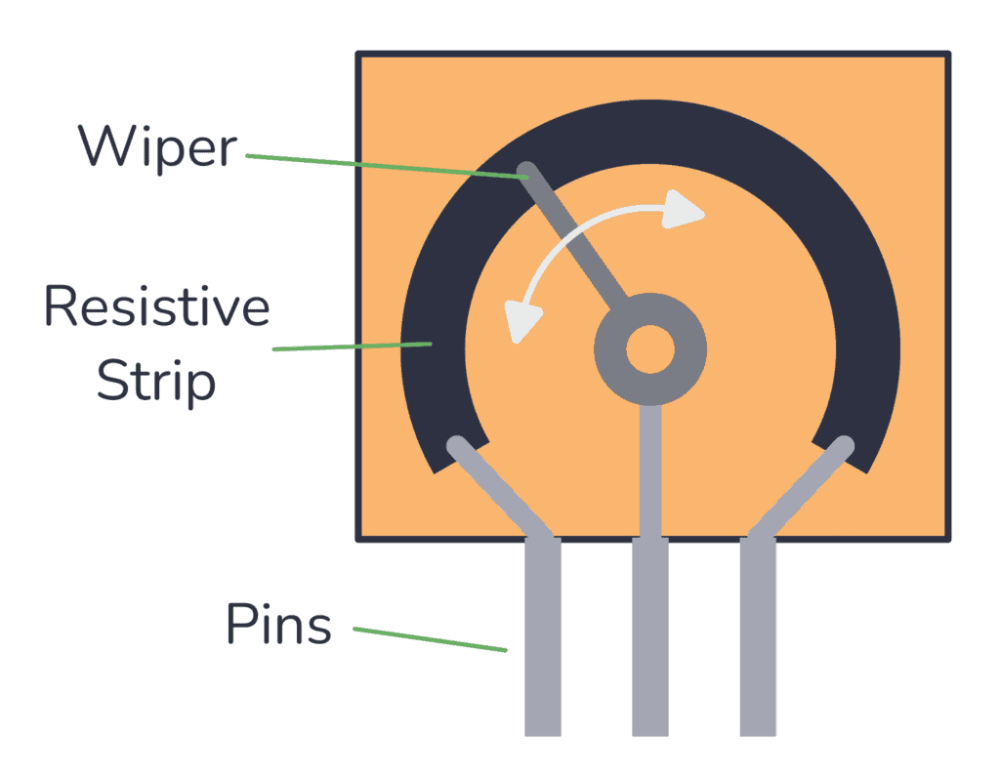

# ECSE 395 Lab 3: Playing with Sensors

**Student:** Joe Falkenburg (`jmf277`)

## Purpose

This is my second assignment working with the ESP32. I connected and streamed readings from two sensors in the SunFounder Universal Maker Sensor Kit: a potentiometer module and a capacitive touch module. The potentiometer exercises analog input and floating-point voltage conversion. The touch module provides a digital input that controls the ESP32 board's onboard red LED.

## Development setup and programs

I used Visual Studio Code with the PlatformIO IDE extension on macOS. PlatformIO builds the Arduino-framework C++ program and uploads it to an **Adafruit Feather ESP32 V2** through a USB-C data cable. The same USB connection carries serial output back to the computer.

| Setting | Configuration |
|---|---|
| Project folder | `Lab 3` |
| PlatformIO environment and board | `adafruit_feather_esp32_v2` |
| Platform | `espressif32@7.1.0`, pinned in [platformio.ini](platformio.ini) |
| Framework | Arduino |
| Program and serial-monitor baud rate | `115200` |
| Sensor input | Feather `A1`, mapped to GPIO25 |
| Sensor power | Feather `3V` and common `GND` |
| Touch-controlled LED | Feather's onboard red LED, GPIO13 |

The [Feather V2 pinout guide](https://learn.adafruit.com/adafruit-esp32-feather-v2/pinouts) identifies these board-specific connections. A1 belongs to ADC2, which is shared with Wi-Fi; these programs do not start Wi-Fi.

| Program | Source file | Main operation | Loop delay |
|---|---|---|---|
| Raw potentiometer | [potentiometer.cpp](src/potentiometer.cpp) | Read A1 and print the integer ADC code. | 100 ms |
| Potentiometer voltage | [voltage.cpp](src/voltage.cpp) | Convert a stored ADC code to a `float` voltage estimate and print both values. | 200 ms |
| Touch and LED | [touch.cpp](src/touch.cpp) | Read the module's digital state, print a message, and set GPIO13. | 50 ms |

The source comments beginning with `jmf277` explain the pin choices, readings, conversion, serial messages, delays, and LED control. The raw-reading starter is named `potentiometer.cpp`, as required by the assignment. The unused [main.cpp](src/main.cpp) starter remains disabled.

## Circuits

I used the Feather, a breadboard, the two sensor modules, and three male-to-male jumper wires. The sensors were mounted in separate breadboard strips and connected with removable jumpers. There was no external LED circuit: the touch program controls the red LED already on the Feather.

Both sensor circuits use the same power, ground, and A1 connections. Use **one sensor at a time**; the potentiometer serves both analog programs, and the touch module replaces it for the final program. Disconnect USB before changing either circuit, and follow the printed labels on the module.

| Connection | Potentiometer | Touch module | Feather | Jumper in my assembly |
|---|---|---|---|---|
| Ground | `GND`, b30 | `GND`, b30 | `GND` | Black: a8 to e30 |
| Supply | `VCC`, b31 | `VCC`, b31 | `3V` | Red: a6 to e31 |
| Signal | `OUT`, b32 | `IO`, b32 | `A1` / GPIO25 | Orange: a10 to e32 |

In this layout, the Feather straddles the breadboard's center channel, with its long header in b5-b20 and short header in h9-h20; the USB connector faces the row-1 end. The sensor's three pins occupy b30, b31, and b32. Holes a-e within one numbered row are connected internally, so a jumper at e31 connects to the sensor pin at b31. Adjacent numbered rows remain separate.

### Potentiometer operation

Turning the knob moves a **wiper** along a resistive strip. With the strip connected between supply and ground, the wiper provides a variable voltage to the ADC. This is the voltage-divider operation described in the [SunFounder potentiometer reference](https://docs.sunfounder.com/projects/umsk/en/latest/01_components_basic/13-component_potentiometer.html).



*Potentiometer illustration supplied in the course repository.*

The illustration shows the internal component terminals. The module's PCB routes those connections to its labelled header: **GND, VCC, and OUT** in my assembly. Its middle header pin is VCC. SunFounder's written documentation calls the analog output `AO`; the physical module labels it `OUT`.

### Touch-module operation

The external capacitive touch module supplies a **digital** signal on `IO`: HIGH during contact and LOW after release. A1 can be used as a digital input as well as an analog input. The program therefore uses `digitalRead(A1)` to read the module, consistent with the course's touch example and the [SunFounder touch-module reference](https://docs.sunfounder.com/projects/umsk/en/latest/01_components_basic/22-component_touch.html).

## Program implementation

### Raw potentiometer readings

`potentiometer.cpp` starts serial communication at 115200 baud, selects 12-bit ADC resolution with `analogReadResolution(12)`, and applies `ADC_11db` attenuation to A1. Each loop stores `analogRead(sensorPin)` in the integer `sensorValue` and prints it after the label `ADC:`.

A 12-bit result has 4096 possible codes, numbered **0 through 4095**. Turning the knob changes the analog input and therefore the reported code. The 100 ms delay gives approximately ten updates per second before acquisition and serial-output overhead.

### Floating-point voltage conversion

`voltage.cpp` uses the same potentiometer circuit and ADC settings. Each loop:

1. Reads A1 once into `int sensorValue`.
2. Passes that stored value to `voltage(sensorValue)` and stores the returned `float` in `sensorVoltage`.
3. Prints the raw code and estimated voltage to three decimal places, including the `V` unit.
4. Waits **200 ms**, changing the starter's 50 ms delay and giving approximately five updates per second before overhead.

The function is declared and defined as `float voltage(float analogValue)`. It implements the lab's nominal scaling with `referenceVoltage = 3.3f` and `adcMaximum = 4095.0f`:

```text
estimated voltage = ADC code × 3.3 / 4095
```

Here, 4095 is the largest ADC code, while 4096 is the number of representable codes. The formula maps the endpoint codes to nominal values of 0.0 V and 3.3 V. Floating-point constants, storage, and return type preserve fractional volts that an integer result would discard.

For a **calculated example**, an ADC code of 2048 produces approximately 1.650403 V and would be printed as:

```text
ADC: 2048 | Estimated voltage: 1.650 V
```

This conversion provides an **estimate based on nominal 3.3 V scaling**. It is not a calibration of the ESP32 ADC. Supply variation, ADC nonlinearity, and saturation near the rails limit its accuracy; a displayed endpoint can occur before the knob reaches its mechanical stop. Three printed decimal places describe the output format, not demonstrated voltage accuracy. Espressif documents [`analogRead()` as an uncalibrated raw reading](https://docs.espressif.com/projects/arduino-esp32/en/latest/api/adc.html).

### Touch input and onboard LED

`touch.cpp` defines `sensorPin = A1` and `ledPin = 13` above `setup()`. In `setup()`, it starts serial communication, sets the sensor pin to `INPUT`, and then sets the LED pin to `OUTPUT`.

Each loop stores `digitalRead(sensorPin)` in `sensorValue` and uses an `if`/`else` statement:

| Input state | Serial message | LED action |
|---|---|---|
| HIGH, touch detected | `Touch detected!` | `digitalWrite(ledPin, HIGH)` turns the red LED on. |
| LOW, released | `No touch detected...` | `digitalWrite(ledPin, LOW)` turns the red LED off. |

The LED action follows the corresponding print statement in each branch. The program waits 50 ms before sampling again, giving approximately twenty checks per second before overhead. It prints on every loop, so holding a touch produces repeated messages. The LED state persists between checks and follows the sampled contact state. The red LED on the Feather is separate from the touch module's green indicator.

## Experimental results

The following results come from the final serial captures made on September 12, 2026. The [measurement appendix](data/README.md) contains the complete datasets and column definitions.

| Exercise | Recorded result |
|---|---|
| Raw potentiometer | **1,251 samples**, spanning ADC **0-4095**. After the sweep, the final 300 samples at an intermediate knob setting ranged from **1594 to 1610**, with median **1603**. |
| Voltage conversion | **712 paired readings**, spanning ADC **0-4095** and estimated **0.000-3.300 V**. Every printed voltage agrees with the programmed formula after rounding to three decimal places. The final 100 readings at the held setting ranged from **1.462 to 1.472 V**. |
| Touch and LED | **4,154 state messages** containing **four complete touch/release cycles**. The sequence began and ended in no-touch. I observed the Feather's red LED turn on during contact and off after release. |

The raw sweep demonstrates a working potentiometer response through the assembled circuit. The voltage sweep demonstrates the acquisition and floating-point conversion working together; it does not establish calibrated voltage accuracy. An intermediate knob setting need not be the exact mechanical or electrical midpoint.

The touch capture contains repeated state messages because the program prints on every loop. Its serial data records the input states and messages; the LED observation is also directly visible in the demonstration below. The CSV timestamps are elapsed host receipt times, including buffering, rather than precise device sample times or response-latency measurements.

### Demonstration recordings

- **[Potentiometer and voltage demonstration](videos/potentiometer-voltage-demo.mp4)** — about 33 seconds. The circuit and knob movement are visible alongside readable serial output reaching **ADC 4095 / 3.300 V** and **ADC 0 / 0.000 V**, then returning to approximately **1.41 V**. This recording is a separate run from the serial capture that ended near 1.47 V.
- **[Touch sensor and LED demonstration](videos/touch-led-demo.mp4)** — about 23 seconds. The recording shows finger contact/release, the circuit, and matching serial messages with the Feather's red LED on during touch and off after release.

## Selecting and running a program

PlatformIO compiles the `.cpp` files in `src` together. Each exercise defines its own `setup()` and `loop()`, so exactly one sketch must be active. The project currently selects **`touch.cpp`** and follows the handout's whole-file block-comment method.

| Exercise to run | Active file | Files enclosed entirely in `/* ... */` |
|---|---|---|
| Raw potentiometer | `potentiometer.cpp` | `main.cpp`, `voltage.cpp`, `touch.cpp` |
| Estimated voltage | `voltage.cpp` | `main.cpp`, `potentiometer.cpp`, `touch.cpp` |
| Touch and LED | `touch.cpp` | `main.cpp`, `potentiometer.cpp`, `voltage.cpp` |

To change exercises, put `/*` before the first line and `*/` after the last line of the active sketch, then remove only those outer markers from the desired sketch. Preserve the internal `// jmf277` comments and keep `main.cpp` disabled. Save the files before building.

1. Open the `Lab 3` folder through **PlatformIO Home → Open Project** in VS Code.
2. Select the desired sketch as described above. Under **Project Tasks → adafruit_feather_esp32_v2 → General**, run **Build**.
3. With USB disconnected, assemble the matching circuit. Connect the Feather to the Mac with the USB-C data cable.
4. Close any other serial monitor using the board, then run **Upload** for the same environment.
5. Run **Monitor** at **115200 baud**. Turn the potentiometer for either analog program, or touch/release the pad and watch the red LED for the touch program.

The equivalent commands from a PlatformIO Core CLI terminal in this folder are:

```sh
pio run -e adafruit_feather_esp32_v2
pio run -e adafruit_feather_esp32_v2 -t upload
pio device monitor -b 115200
```

In a regular macOS terminal where `pio` is not on PATH, the installed executable can be called as `"$HOME/.platformio/penv/bin/pio"`. PlatformIO normally detects the USB serial port; `pio device list` lists available devices if selection needs checking. Stop the monitor with **Control+C** before the next upload. Each program change requires a new build and upload; selecting an editor tab does not select the firmware. See the [PlatformIO VS Code workflow](https://docs.platformio.org/en/latest/integration/ide/vscode.html).

## Time reporting and reflection

### 1. How long did the assignment take?

**4 hours.** I understood the concepts; completing the work took time, but the time spent should not be interpreted as difficulty understanding the material.

### 2. What level of difficulty would I associate with it?

**Low.**

### 3. If the difficulty was medium or high, what was the most difficult aspect?

**N/A**, because I rated the difficulty low.

### 4. How comfortable do I currently feel with the course content?

**Comfortable.**

### 5. Do I have additional information or feedback for the instructors?

**N/A.**

## Course references

The assignment requirements come from Dr. Alexis E. Block and Michael Fu's **ECSE 395 Lab 3 handout**, dated September 10, 2026, and the expanded [Lab 3 Canvas rubric](https://canvas.case.edu/courses/54050/assignments/757781). The programs adapt the course's starter files and the touch/LED example in **Lab 3 intro.mp4**. The potentiometer illustration was supplied in the starter repository. Board, module, ADC, and development-tool references are linked alongside the relevant explanations above.
