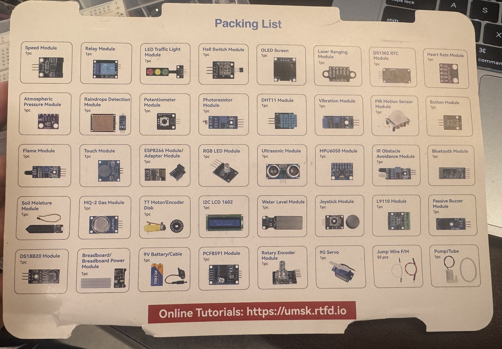
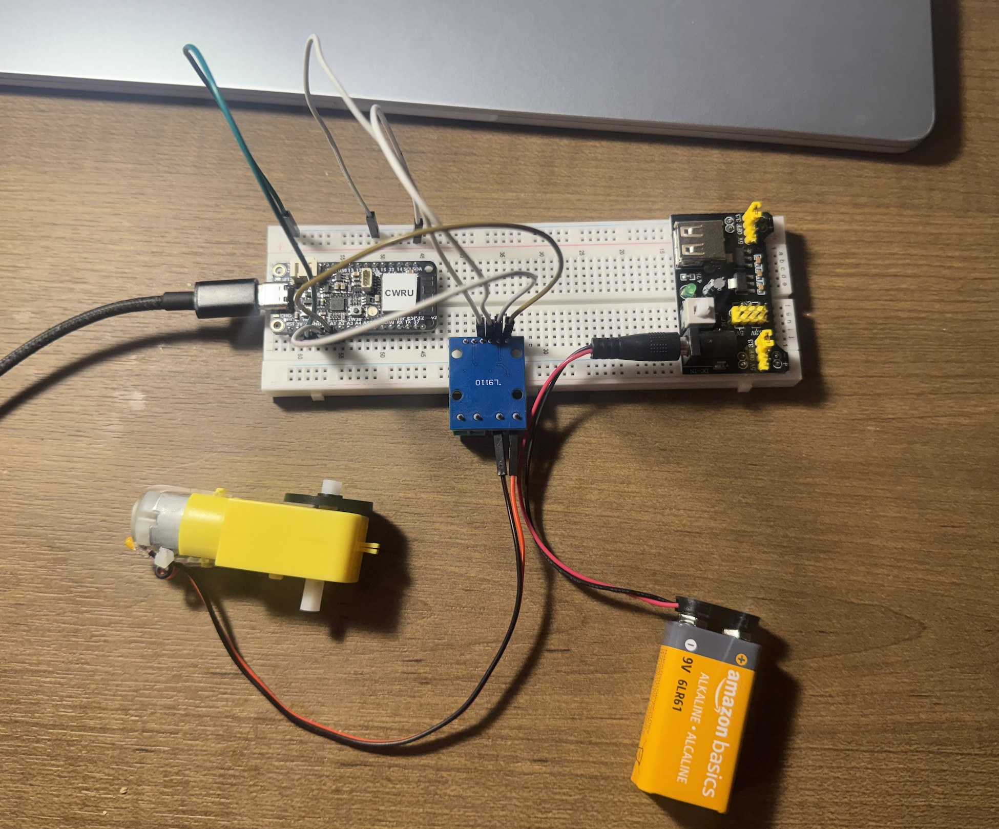
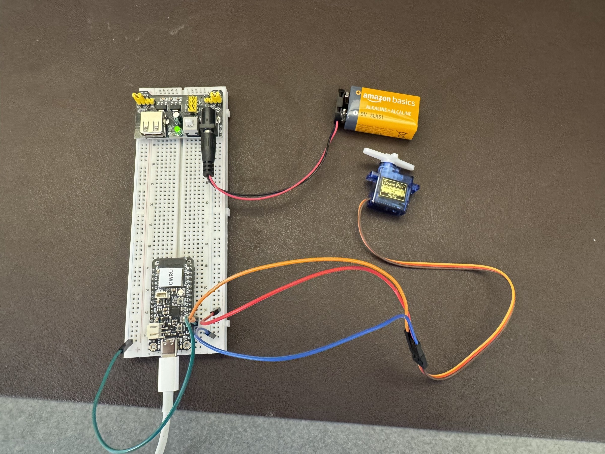

# ECSE 395 Lab 4: Actuator Adventures

**Student:** Joe Falkenburg (`jmf277`)

## Purpose

This is my third assignment working with the ESP32. After blinking the onboard LED in Lab 2 and reading sensors in Lab 3, this lab connects **actuators** to the board so that it makes things move. The in-class task drives a **TT motor** (a DC gear motor) through an L9110 motor-driver module, and the post-class task positions a **9 g servo motor**. Both come from the SunFounder Universal Maker Sensor Kit.

The two motors look similar and both are used in robotics, but they are controlled differently, as the handout's Table 1 summarizes:

| Feature | Servo motor | TT motor (DC gear motor) |
|---|---|---|
| Control | A pulse-width-modulated (PWM) signal sets and holds a position | Voltage and polarity set speed and direction |
| Movement | Moves to a specific angle, 0° to 180° for a standard servo | Rotates continuously; there is no position control |
| Feedback | Yes: a potentiometer inside the servo closes the loop | No: an open-loop system |
| Built-in parts | Motor, gear reduction, potentiometer and controller | Motor and a plastic gearbox (1:48) that lowers speed and raises torque |
| Use cases | Precise angular control, such as robotic arms and pan-tilt mounts | Continuous rotation, such as wheels and conveyor belts |

## Equipment

All of the hardware is CWRU-owned course equipment issued to me directly by the teaching team for the semester: the Adafruit Feather ESP32 V2 and the SunFounder Universal Maker Sensor Kit, which came to me together in the kit's box. Dr. Fu approved my taking the kit home so I could finish the lab away from the Sears Lab; equipment issued this way did not go through the check-out form. Everything I used came in that box, whose packing list is shown below, except the USB-C data cable, which is my own from the earlier labs.

| Used for | Hardware |
|---|---|
| Both circuits | Feather ESP32 V2 on the Mac's USB-C cable; breadboard; breadboard power module; 9 V battery with its snap-to-barrel cable; jumper wires |
| TT motor circuit | TT motor with its encoder disk; L9110 motor-driver module |
| Servo circuit | 9G servo (SG90) |



Nothing was soldered: the driver plugs into the breadboard by its header pins, the motor's pin-ended leads sit in the driver's screw terminal, and the servo's three-pin connector takes the male ends of jumper wires, as the handout requires.

## What a reader will find in this repository

Everything for this lab is in the `Lab 4` folder of my course repository, [F26-ECSE395-jmf277](https://github.com/jmf277/F26-ECSE395-jmf277).

| Item | Where | What it is |
|---|---|---|
| This report | [actuator_adventures.md](actuator_adventures.md) | Setup, wiring, program descriptions, parameter observations, and the time report and reflection. |
| Folder index | [README.md](README.md) | A short overview with the program table and run instructions. |
| Course instructions | [Instructions/TT Motor.md](Instructions/TT%20Motor.md), [Instructions/Servo Motor.md](Instructions/Servo%20Motor.md) | The wiring and task descriptions supplied with the assignment. Their wiring text predates the updated diagrams and still powers the motors from the Feather's `VBUS` pin; my circuits follow the updated diagrams instead. |
| Wiring diagrams | [TT Motor Connection.png](photos/TT%20Motor%20Connection.png), [Servo Motor Connection.png](photos/Servo%20Motor%20Connection.png), and the handout's [Figure 2](photos/TT%20Motor%20Connection%20-%20handout%20Figure%202.png) and [Figure 3](photos/Servo%20Motor%20Connection%20-%20handout%20Figure%203.png) | The updated course diagrams: the first two from the course template's September 17, 2026 commit (bench supply, drawn on a Feather ESP32-C6 rather than the Feather ESP32 V2 the course issues), the other two from the February 11, 2026 revision of the handout (the kit's breadboard power module on a 9 V battery, drawn on the Feather ESP32 V2). My circuits follow the handout's Figures 2 and 3, plus the common-ground jumper that the template diagrams draw. |
| Build configuration | [platformio.ini](platformio.ini) | One PlatformIO environment per program, all for the `adafruit_feather_esp32_v2` board, with the ESP32Servo library dependency and the 115200-baud monitor setting. |
| In-class, first half | [src/TT Motor.cpp](src/TT%20Motor.cpp) | Runs the TT motor once from `setup()`. A `TRIAL` constant selects which one of the starter's values is changed: the `analogWrite()` value, the swapped values, or the `delay()`. |
| In-class, second half | [src/TT Motor Rotate.cpp](src/TT%20Motor%20Rotate.cpp) | Clockwise for 5 s, stop for 2 s, counterclockwise for 5 s, stop for 2 s, repeated forever, with every line commented. |
| In-class extra credit | [src/TT Motor EC.cpp](src/TT%20Motor%20EC.cpp) | Continuously ramps the motor speed up and down in both directions. |
| Post-class, first half | [src/Servo Motor.cpp](src/Servo%20Motor.cpp) | Sweeps the servo from 0° to 180° and back. A `TRIAL` constant selects which one of `minPulseWidth`, `maxPulseWidth`, `setPeriodHertz`, the rotation range, or the `delay` is changed. It also carries the return-sweep fix that the intro video calls out. |
| Post-class, second half | [src/Servo Motor Random.cpp](src/Servo%20Motor%20Random.cpp) | Moves the servo to random angles between 0° and 180° with random pauses between moves. |
| Post-class extra credit | [src/Servo Motor EC.cpp](src/Servo%20Motor%20EC.cpp) | Moves the servo with gradual acceleration and deceleration using a selectable motion profile. |
| Circuit photos | [photos/tt-motor-circuit.jpg](photos/tt-motor-circuit.jpg), [photos/servo-circuit.jpg](photos/servo-circuit.jpg) | My assembled circuits. The Feather pinout image is in the same folder. |
| Demonstration videos | [videos/tt-motor-rotate-demo.mp4](videos/tt-motor-rotate-demo.mp4), [videos/servo-random-demo.mp4](videos/servo-random-demo.mp4) | The rotate sequence running on the TT motor (about 30 seconds), and the random-angle program running on the servo (about 45 seconds). |
| Extra-credit videos | [videos/tt-motor-ec-demo.mp4](videos/tt-motor-ec-demo.mp4), [videos/servo-ec-demo.mp4](videos/servo-ec-demo.mp4) | The speed ramp running on the TT motor, and the accelerating and decelerating sweep running on the servo. |

Every functional change I made to a starter file is marked with a comment beginning `jmf277`, so the starter's lines and my lines can be told apart. I also tidied a few of the starter's own comments, such as typos and the fill-in-the-blank hints that the completed code no longer needs.

## Development setup and how I upload the code

I used Visual Studio Code with the PlatformIO IDE extension on macOS, as in Labs 2 and 3. PlatformIO compiles the Arduino-framework C++ program and uploads it to the Feather over the USB-C data cable; the same cable carries the serial output back to the Mac.

| Setting | Configuration |
|---|---|
| Project folder | `Lab 4`, opened through **PlatformIO Home → Open Project** |
| Board | `adafruit_feather_esp32_v2` |
| Platform | `espressif32@7.1.0`, pinned in [platformio.ini](platformio.ini); it provides Arduino core 2.0.17 |
| Framework | Arduino |
| Library | `madhephaestus/ESP32Servo@^3.2.1` in `lib_deps`, the line the intro video's **Add to Project** step writes (it is visible in the video's `platformio.ini`); PlatformIO installed version 3.2.1 |
| Serial baud rate | `115200` in every program and as `monitor_speed` |
| Actuator pins | Feather `A0` (GPIO 26) and `A1` (GPIO 25) |
| Motor power | The kit's breadboard power module on a 9 V battery, as in the handout's Figures 2 and 3: a rail set to 3.3 V for the motor driver and a rail set to 5 V for the servo, with the module's − rail wired to Feather `GND`; the Feather itself stays on USB power |

### Tools used

PlatformIO's Library Manager reads the `lib_deps` line and downloads ESP32Servo into the project's `.pio` folder the first time an environment is built, so nothing has to be installed by hand. The intro video adds the same library through **PIO Home → Libraries**, searching for ESP32Servo and clicking **Add to Project**, which writes the same `madhephaestus/ESP32Servo@^3.2.1` line into `platformio.ini`. The `.pio` build folder is excluded from Git by the folder's `.gitignore`.

### One environment per program

Every `.cpp` file in `src` defines its own `setup()` and `loop()`, and PlatformIO compiles all of `src` together, so a plain build of this folder would fail with duplicate definitions. In Lab 3 I solved this by enclosing the inactive programs in block comments. For this lab I used PlatformIO's `build_src_filter` instead: each environment in [platformio.ini](platformio.ini) compiles exactly one file, so all six programs stay readable and uncommented, and switching programs is a matter of picking an environment rather than editing files. The intro video, like Lab 3, asks for the inactive files to be commented out so that only one file is active; the environments give the same single active program at build time without editing the files.

| Environment | Compiles |
|---|---|
| `tt_motor` | `TT Motor.cpp` |
| `tt_motor_rotate` | `TT Motor Rotate.cpp` |
| `tt_motor_ec` | `TT Motor EC.cpp` |
| `servo_motor` | `Servo Motor.cpp` |
| `servo_motor_random` | `Servo Motor Random.cpp` |
| `servo_motor_ec` | `Servo Motor EC.cpp` |

`default_envs = servo_motor_random` makes the random-angle program the one that builds when no environment is chosen.

### Upload process

1. Open the `Lab 4` folder as a PlatformIO project in VS Code.
2. Pick the environment: click the environment name in the blue status bar at the bottom of the window (it shows `Default` or an `env:` name) and choose from the list, or expand **Project Tasks** in the PlatformIO sidebar, where each environment has its own **General → Build / Upload / Monitor** entries. The instruction files refer to a **Project Tasks → adafruit_feather_esp32_v2** entry; in this project that single entry is replaced by the six environments above, and the board of that name is set once in the `[env]` section they all inherit.
3. Run **Build** and check for `SUCCESS`. All six environments build successfully.
4. With the USB cable unplugged and the power module switched off, assemble the circuit for that program (tables below) and check it against the wiring table and the handout figure, then connect the Feather to the Mac with the USB-C data cable and switch the power module on; its green LED lights.
5. Close any serial monitor that is still using the board, then run **Upload** for the same environment. PlatformIO detects the USB serial port automatically.
6. Run **Monitor** at 115200 baud (the status bar's plug icon, or **Upload and Monitor** to do both). The programs print what they are doing, for example `Clockwise` or `Angle: 45  pulse: 1000 us`.

From a terminal in the `Lab 4` folder, the equivalent PlatformIO Core commands are:

```sh
pio run -e tt_motor_rotate
pio run -e tt_motor_rotate -t upload
pio device monitor -b 115200
```

If the upload times out with `Failed to connect to ESP32`, close any open serial monitor, check that the cable carries data and that the right port was chosen, press the Feather's **RESET** button and retry. The Lab 2 instructions' BOOT-button step applies to development boards that have such a button; the Feather V2 has only RESET and a user button on GPIO 38, and its USB-serial chip puts it into upload mode by itself. Stop the monitor with **Control+C** before the next upload.

## Steps to complete this lab

### (a) Setup and preparation

1. Pulled the `Lab 4` folder of my repository, which the course template supplied with the four starter programs, the two instruction files, the wiring diagrams, and the Feather pinout image.
2. Read both instruction files and the handout, and watched the intro video, including the two warnings: put the driver module into the breadboard and do not solder to it or the motor, and unplug the USB cable immediately on any burning smell or spark. The video says the wiring diagrams originally in the repository are outdated and to follow the wiring diagram in the PDF strictly; the revised handout's Figures 2 and 3 are those diagrams, and the circuits below follow them, as step 4 explains.
3. Chose the pins. The handout's TA hint says to use `A0`–`A5`, and the Feather V2 pinout shows that `A2`, `A3` and `A4` (GPIO 34, 39 and 36) are input-only, so they cannot drive anything. `A0` (GPIO 26), `A1` (GPIO 25) and `A5` (GPIO 4) can. I used `A0` and `A1` for the two motor-driver inputs and `A0` for the servo signal. The ESP32's PWM peripheral (LEDC) can be routed to any output-capable pin, and ESP32Servo's list of recommended servo pins includes 25 and 26. SunFounder's own ESP32 lessons for these two parts use GPIO 26/25 for the motor and GPIO 25 for the servo, which agrees with this choice.
4. Chose the power source: the kit's breadboard power module on a 9 V battery, as in the handout's Figures 2 and 3, which the intro video says to follow strictly and which uses only kit parts, so the lab could be finished at home. The module sits on the breadboard's power rails, the battery feeds its barrel jack through the kit's snap cable, its switch turns the rails on, and each rail's jumper selects 5 V, off, or 3.3 V. The motor driver runs from a rail set to 3.3 V, as Figure 2 draws it; the servo runs from a rail set to 5 V, because Figure 3 draws its rail jumper on 3.3 V, below the SG90 datasheet's 4.8–6 V range. Neither figure draws a wire between the Feather's ground and the module's − rail; the template diagrams do, and the intro video says the servo needs it, so both circuits include it. The Feather keeps its USB connection for its own power, programming and the serial monitor, and nothing from the module connects to the Feather's power pins. The comparison below explains what this choice buys over the two alternatives.

#### Choosing the power source, and what each option costs

A motor is not like the LED and the sensors of the earlier labs. It draws current in bursts, largest at the instant it starts and whenever its shaft is held, and when the driver switches it off, the coil's current cannot stop instantly, so it circulates back through the driver and shows up as a transient on the supply rail. Where the motor's current comes from therefore decides what happens to the Feather when something goes wrong. Three options were in front of me.

| Method | Where the motor current flows | What limits the damage from a stall, a short or a wiring mistake | Usable at home? |
|---|---|---|---|
| The Feather's own pins, `VBUS` or `3V`, as in the original diagrams, the instruction files and SunFounder's lessons | From the laptop's USB port, through the Feather's connector and traces, to the motor | Only the laptop port's own cut-off and the Feather's regulator | Yes, nothing extra needed |
| The Sears Lab bench supply, as in the template diagrams and the intro video | From the supply's terminals straight to the driver or servo; the Feather carries only the control signal and a shared ground | An adjustable current limit turns a stall or a short into a harmless voltage fold-back | No, it stays on the bench |
| The kit's breadboard power module on a 9 V battery, as in the handout's Figures 2 and 3, which is what I used | From the battery, through the module's regulator and the breadboard rails, to the driver or servo; the Feather again carries only the signal and a shared ground | The regulator's fixed current and temperature limits, and a switch that cuts motor power instantly | Yes, everything is in the kit |

**From the Feather.** The `3V` pin is the output of the board's 3.3 V regulator, which Adafruit rates at 500 mA peak with about half already taken by the ESP32 itself; a TT motor draws about 150 mA with nothing on its shaft, a brushed motor draws its largest current at the instant it starts and whenever its shaft is held, and a servo pushing against its end stop is a stalled motor too, so either can overload that regulator. `VBUS` is the 5 V arriving from the USB cable, so it can give more, but the current still passes through the laptop's port, the USB connector and the Feather's traces, and a USB port supplies only a limited current and may current-limit or shut the port down when that is exceeded. Either way the motor and the ESP32 hang on one supply: a starting motor can pull the voltage down far enough that the ESP32's brownout detector resets the chip, and each switching transient from the driver lands on the same rail the processor runs from. The likeliest symptom is a board that keeps resetting; the board can be damaged outright if the regulator is overloaded for long or a motor-supply wire lands on a signal pin, and after a reset nothing on the outside tells you which of the two happened. That is the risk I was warned about when the power-module setup was recommended to me for finishing the lab at home. It is also the simplest setup and the one the older course material shows, which is why it is worth knowing what it costs.

**The bench supply.** It sets the exact voltage (3.0 V for the motor and 5 V for the servo in the template diagrams) and a current limit (0.15 A and 0.75 A in the same diagrams), so a stalled motor or a shorted wire simply hits the limit and the voltage folds back, with the laptop and the Feather outside the motor's current path altogether. Its downsides are practical: it does not leave the lab, so the post-class servo work would have had to wait for a bench; the connection is alligator leads plus a separate ground wire that is easy to forget, which the intro video stresses; a limit set too low keeps the motor from starting (0.15 A is right at the TT motor's no-load current), and a voltage turned up past 6 V exceeds the motor's and the servo's ratings.

**The power module on a 9 V battery.** The module accepts 6.5 to 12 V at its barrel jack, puts 3.3 V or 5 V on each breadboard rail according to that rail's jumper, supplies less than 700 mA in total, and has an on/off switch and reverse-polarity protection, per SunFounder's page for it. It keeps the Feather out of the motor's current path like the bench supply does, the switch stops the motor without touching the board, and it comes in the kit, so the whole lab could be finished at home. Its limits: a 9 V alkaline battery holds little energy and its voltage sags under load and as it drains, and as it approaches the module's 6.5 V input minimum the 5 V rail can no longer be held, which would show first as servo jitter and a motor that no longer starts, so the battery will not survive many sessions of motor testing; its total output is rated below 700 mA, less than the driver's 800 mA per channel, and dropping 9 V to the rail voltage leaves the module warm under a steady motor load; there is no adjustable limit, so a short is caught only by the regulator's own protection while it drains the battery; the rail jumpers are easy to set wrong (the handout's own Figure 3 draws the servo's rail on 3.3 V), and nothing warns you; and the rails do not meet the Feather's ground on their own, so the common-ground jumper has to be added and checked, without which the servo does not respond. Finally, Figure 2's 3.3 V rail sits at the bottom of the TT motor's 3 to 6 V rating, which is why half power could not start it in Trial 2; the module's 5 V rail would have given more margin, and I kept Figure 2's setting.

5. Set up [platformio.ini](platformio.ini) as described above, confirmed that PlatformIO resolved ESP32Servo 3.2.1 (the version the intro video adds), and built every environment before touching any hardware.

### (b) In-class task: TT motor

#### Circuit

| Connection | From | To |
|---|---|---|
| Driver power | L9110 `VCC` | The power module's **+** rail, jumper on **3.3 V**, as the handout's Figure 2 draws it |
| Driver ground | L9110 `GND` | The power module's **−** rail |
| Common ground | Feather `GND` | The same **−** rail, so the driver's inputs and the Feather share a reference |
| Direction/speed input 1 | L9110 `A-1A` | Feather `A0` (GPIO 26) |
| Direction/speed input 2 | L9110 `A-1B` | Feather `A1` (GPIO 25) |
| Motor | The TT motor's two pins | The L9110 **Motor A** screw terminals, in either order |

The course updated this wiring in two steps. The February 11, 2026 revision of the handout added Figure 2, which powers this circuit from the kit's breadboard power module on a 9 V battery ([copy](photos/TT%20Motor%20Connection%20-%20handout%20Figure%202.png)); on September 17, 2026, the day before the lab session, the course template replaced its two diagrams with bench-supply versions ([TT Motor Connection.png](photos/TT%20Motor%20Connection.png), copied into this folder), which the intro video also shows in use. The video says the repository's original diagrams are outdated and to follow the PDF's diagram strictly, so my circuit follows Figure 2: the module on the rails, the driver's `VCC` and `GND` on a rail whose jumper is on 3.3 V (the same intent as the bench diagram's 3.0 V). One deliberate difference: the diagrams put the motor in the driver's **Motor B** block and drive the `B-1A`/`B-1B` inputs, while mine uses the **Motor A** block and the `A-1A`/`A-1B` inputs, the two header pins beyond `VCC`. The motor's pins fell straight out of the Motor B block, and I thought I would need a small screwdriver to close its clamp on them, but they seat firmly in the Motor A block, so I used that block and its inputs instead; the course's TT Motor.md allows the swap ("You can change into A-1A if you connect the driver to the motor in A"). The two channels are separate but identical L9110S chips with the same truth table, so the program's logic is unchanged; only the constant names say A. Figure 2 puts the first input on `A0` and the second on `A1`, as SunFounder's lesson does and as the code uses; the template diagram, drawn on a Feather ESP32-C6 rather than the course's Feather ESP32 V2, puts them the other way round, which would only swap which direction the program calls clockwise. Figure 2 draws no wire between the Feather's ground and the module's − rail. The template diagram does, and the intro video notes that the motor ran without one in the instructor's setup because the motor only needs the voltage difference at its terminals; but the driver reads its inputs against its own ground, the jumper costs one wire, and the servo circuit needs it anyway, so it is included.

The L9110 module is plugged into the breadboard by its six header pins, as the handout asks. On this module the pins stick up from the component side, so the only way to seat them is to turn the board over: it sits component side down, with the green terminal blocks facing the table and overhanging the breadboard's front edge, which is why the photo shows the back of the board. The four jumpers go into the breadboard holes directly behind the header pins: `A-1A` and `A-1B` to the rows of the Feather's `A0` and `A1` pins, `VCC` and `GND` to the + and − of the 3.3 V rail, with one more jumper from the Feather's `GND` row to that − rail. The motor's wires end in 0.1-inch pins that clamp into the green terminal block. The wire order in the terminal block only decides which direction the program calls clockwise; swapping the two wires swaps the directions.



#### How the driver responds to the two inputs

The L9110 module holds two L9110S H-bridge chips, one per motor block, each rated for 800 mA and 2.5–12 V. SunFounder gives the same truth table for both; for the A channel used here:

| `A-1A` | `A-1B` | Motor A |
|---|---|---|
| 1 | 0 | Rotates clockwise |
| 0 | 1 | Rotates counterclockwise |
| 0 | 0 | Brake |
| 1 | 1 | Stop |

Driving one input high and the other low puts the driver's supply, the 3.3 V rail less the driver's own drop, across the motor in one polarity; reversing the inputs reverses the polarity and therefore the direction. With both inputs at the same level, no current is driven through the motor, so it stops.

`analogWrite()` on the ESP32 Arduino core is not a true analog voltage: it is a PWM signal from the LEDC peripheral at 1 kHz with 8-bit resolution, so the value 0–255 sets the fraction of each millisecond that the input is high. With `A-1B` held at 0, the motor receives the supply voltage for that fraction of the time, and its speed follows the average voltage. So 255 is full speed, 128 is roughly half the average voltage, and 0 is off.

#### Trials in `TT Motor.cpp`

The starter runs the motor once from `setup()` and leaves `loop()` empty; pressing **RESET** on the Feather runs it again. I kept that structure and added a `TRIAL` constant with a `switch` in `configureTrial()` that changes exactly one value at a time relative to the starter, plus a serial line that prints which trial is running so the monitor and the video show it. The trials are run in order by changing `TRIAL`, building, and uploading; the committed file is set to `TRIAL = 4`, the last trial, so uploading it as-is gives the 2 s run.

| Trial | Value changed | Code | Behavior |
|---|---|---|---|
| 1 | None, the starter | `analogWrite(A-1A, 255)`, `analogWrite(A-1B, 0)`, `delay(5000)` | The motor spins at full speed in one direction for 5 s, then both inputs go to 0 and it stops. |
| 2 | `analogWrite()` value: 255 → 128 | `speedA = 128` | The motor did not turn: for the 5 s it gave a steady tone and no rotation. 128 is a 50 % duty cycle, so the motor got about half of what the driver puts out, the 3.3 V rail less the L9110S's drop of roughly a volt, so about 1.2 V on average, below what this 3–6 V gearbox needs to start, and the tone is the 1 kHz PWM heard in the windings. Since 255 ran it and 128 did not, this rail's usable range of `analogWrite()` values begins somewhere above 128. |
| 3 | Swapped `analogWrite()` values: `A-1A` 0 and `A-1B` 255 | `speedA = 0`, `speedB = 255` | The motor spins at full speed in the opposite direction for 5 s: the PWM now drives `A-1B`, which is the second row of the truth table. |
| 4 | `delay()`: 5000 → 2000 ms | `runTimeMs = 2000` | Same direction and speed as the starter, but the run lasts 2 s instead of 5 s before the stop. The delay only sets how long the motor keeps running. |

I built and ran the motor circuit on September 20, 2026, two days after the servo circuit; the report follows the handout's order rather than mine. The driver was on the power module's 3.3 V rail, and I uploaded each trial and pressed RESET to repeat it. Trial 1 spun the motor fast for about 5 s and stopped. Trial 2 gave the steady tone and no rotation described in the table. Trial 3 spun the motor at full speed in the other direction for 5 s. Trial 4 ran like Trial 1 and stopped after 2 s. The serial log agrees: the start line and the `Motor stopped` line were 5.0 s apart for Trials 1–3 and 2.0 s apart for Trial 4, with no board resets.

#### Rotate sequence in `TT Motor Rotate.cpp`

The second program fills in the starter's blanks so that `loop()` runs four steps, each announced in the serial monitor, and repeats forever:

| Step | `A-1A` | `A-1B` | Duration | Serial message |
|---|---|---|---|---|
| 1 | `HIGH` | `LOW` | 5 s | `Clockwise` |
| 2 | `LOW` | `LOW` | 2 s | `Stop` |
| 3 | `LOW` | `HIGH` | 5 s | `Counterclockwise` |
| 4 | `LOW` | `LOW` | 2 s | `Stop` |

This program uses `digitalWrite()` rather than `analogWrite()`, so the driven input is high all the time and each rotation runs at full speed. `setup()` starts the serial port at 115200 baud, sets both pins as outputs, and prints a description of the sequence. The two durations are named constants (`RUN_TIME_MS`, `STOP_TIME_MS`) so they are easy to change. Every statement in the program has a comment explaining what it does.

[Video: the rotate sequence running on my TT motor](videos/tt-motor-rotate-demo.mp4), about 30 seconds, with the motor, the Feather, the power module and the serial monitor in the frame: the shaft turns one way, stops, turns the other way and stops, in step with the `Clockwise`, `Stop`, `Counterclockwise`, `Stop` lines.

#### Extra credit: `TT Motor EC.cpp`

The extra-credit program keeps the motor's speed changing continuously. A helper, `driveMotor(signedSpeed)`, takes one number from −255 to 255: the sign chooses the direction by picking which driver input carries the PWM, and the magnitude is the duty cycle. `rampSpeed()` then steps the duty cycle one count at a time with a 12 ms pause per step, so each ramp from stopped to full speed takes about 3 s. Each pass through `loop()` ramps up and down clockwise, rests for half a second, ramps up and down counterclockwise, and rests again, printing the duty cycle at 0, 25, 50, 75 and 100 %. On the 3.3 V rail the motor does not start until the duty cycle is well above 128 (Trial 2 showed that 128 alone only makes it hum), so each ramp up is a second or two of tone followed by an abrupt start and a run up to full speed, and on each ramp down the shaft keeps turning somewhat below the point where it started, because a turning motor needs less voltage than a stationary one, before it stops and the direction reverses.

[Video: the speed ramp running on my TT motor](videos/tt-motor-ec-demo.mp4), about 35 seconds, with the serial monitor in the frame: the tone, the abrupt start, the run up to full speed, the slow-down and the reversal are all audible and visible.

### (c) Post-class task: servo motor

#### Circuit

| Connection | Servo wire | To |
|---|---|---|
| Power | Red | The power module's **+** rail, jumper on **5 V** |
| Ground | Brown | The power module's **−** rail, which is also wired to Feather `GND` |
| Signal | Orange | Feather `A0` (GPIO 26) |

The servo's three-pin connector is joined to the breadboard with male-to-male jumper wires, so nothing is soldered. The intro video stresses that the Feather, the servo and the servo's supply must share a ground, because the servo reads its signal pulse relative to its own ground wire; the jumper from the Feather's `GND` to the module's − rail provides it. Both updated diagrams put the signal on `A0`. The template diagram ([Servo Motor Connection.png](photos/Servo%20Motor%20Connection.png)) runs the servo at 5 V from a bench supply limited to 0.75 A. The handout's Figure 3 ([copy](photos/Servo%20Motor%20Connection%20-%20handout%20Figure%203.png)) uses the kit's breadboard power module, which my circuit follows, but draws the servo's rail jumper on 3.3 V, below the SG90 datasheet's 4.8–6 V operating range, so that rail's jumper is set to 5 V here.



#### How a servo is positioned

A hobby servo expects a pulse about every 20 ms (50 Hz) and reads the pulse's width as the target angle: about 1.5 ms means the middle position (90°), shorter pulses turn the shaft toward 0° and longer ones toward 180°. The valid range depends on the servo; SunFounder gives about 0.5–2.5 ms as the usual range for servos of this kind, which is what the starter uses, while the SG90 datasheet marks 1–2 ms for ±90°. The controller inside the servo compares the commanded angle with its potentiometer and drives its own motor until they match, then holds there, which is the feedback that a TT motor lacks.

The ESP32Servo library produces these pulses with the ESP32's LEDC PWM hardware. `attach(pin, min, max)` configures the PWM channel and stores the pulse widths that stand for 0° and 180°, clamping `min` to at least 500 µs and `max` to at most 2500 µs; the first `writeMicroseconds()` call starts the pulses. `writeMicroseconds()` sets the pulse width directly, clamped into that range, and `setPeriodHertz()` sets the pulse repetition rate. The starter maps angles to pulse widths itself with `map(angle, 0, 180, minPulseWidth, maxPulseWidth)`, which scales linearly: 0° → 500 µs, 90° → 1500 µs, 180° → 2500 µs.

#### The starter's return-sweep bug

The starter's second loop was `for (int angle = 180; angle <= 0; angle--)`. The condition `180 <= 0` is false before the first pass, so the return sweep never ran: the servo swept up to 180° over about 2.7 s and then jumped straight back to 0° when `loop()` started again. The Lab 4 intro video points this out (line 33 of the starter, `<=` to `>=`), the course template was corrected on September 17, 2026, and SunFounder's original lesson, which the starter was adapted from, already had `>=`. My file uses `>=` (against the trial's start angle) so the servo sweeps back down as the handout describes, and the fix is noted in the source.

#### Trials in `Servo Motor.cpp`

As with the motor, a `TRIAL` constant selects one change at a time from the starter values, and the program prints the active parameters when it starts and the angle and pulse width every 15°. The committed file is set to `TRIAL = 6`, the last trial, so uploading it as-is gives the fast 5 ms sweep. I also moved the `setPeriodHertz()` call before `attach()`, the order used in the library's own examples; the starter's order also works with this library version, because `setPeriodHertz()` detaches and re-attaches the pin, but setting the rate first avoids that extra step.

| Trial | Parameter changed | Starter → trial | Behavior |
|---|---|---|---|
| 1 | None, the starter | `500` µs, `2500` µs, `50` Hz, `0–180`, `15` ms | The servo sweeps from one end of its travel to the other and back. Each direction is 181 one-degree steps at 15 ms, about 2.7 s, so one full cycle takes about 5.4 s. |
| 2 | `minPulseWidth` | 500 → 1000 µs | The 0° end of the sweep moves inward: the sweep now covers 1000–2500 µs, so the shaft no longer reaches its lowest position and the arc is about a quarter shorter. The number of steps and the time per sweep are unchanged, so the shaft moves more slowly through the smaller arc. |
| 3 | `maxPulseWidth` | 2500 → 2000 µs | The mirror image: the 180° end moves inward, the sweep covers 500–2000 µs, and the shaft stops short of its highest position by about a quarter of the arc, again at the same 2.7 s per sweep. |
| 4 | `setPeriodHertz` | 50 → 100 Hz | The pulses arrive every 10 ms instead of every 20 ms. The library scales its timer so each pulse keeps the same width, so the positions and the sweep time do not change; the servo just receives twice as many position updates per second, and the shorter period halves the timer's step from about 19.5 µs to about 9.8 µs, so the sweep is made of finer steps. The sweep looked the same as in Trial 1. The refresh rate matters at the other end: each pulse tells the servo where to hold, and if pulses come too seldom an analog servo's holding torque drops and it twitches between them, which is why 50 Hz is the standard. |
| 5 | Rotation range | 0–180 → 45–135 | The servo sweeps only the middle quarter-turn, between 1000 and 2000 µs. Each direction is 91 steps, about 1.4 s, so the cycle is about half as long as the starter's, and the shaft never approaches either end stop. |
| 6 | `delay` | 15 → 5 ms per step | The same full sweep runs three times faster, about 0.9 s per direction, and the servo kept up: the SG90 datasheet's 0.1 s, the usual no-load figure for 60°, is about 1.7 ms per degree, so a 5 ms step still leaves it time to arrive, with less margin to settle than at 15 ms. Steps shorter than about 2 ms would have the commands running ahead of the shaft. |

One limit applies to every trial at 50 Hz: with the library's default 10-bit timer, the 20 ms period is divided into 1024 ticks of about 19.5 µs, so only about 102 distinct pulse widths exist between 500 and 2500 µs, about 1.8° apart. Consecutive one-degree commands therefore often produce the same pulse, and the motion is a series of small steps rather than a perfectly smooth glide. Trial 4 halves the period, so its ticks are about 9.8 µs and about 205 widths, about 0.9° apart, fit in the same range. The extra-credit program raises the timer to 16 bits for this reason.

I ran the six trials in order on September 18, 2026, with the servo on the power module's 5 V rail. In every trial the arm followed the commanded sweep, and the change from the starter matched the table: Trial 2 shortened the arc at one end and Trial 3 at the other, Trial 4 looked like Trial 1, Trial 5 swept only the middle, and Trial 6 ran the full arc about three times faster. The serial output confirms the timing: with a message every 15°, the program printed 144 lines in 30 s for Trials 3 and 4 (about 5.4 s per up-and-down cycle), 154 for Trial 5 (about 2.7 s per cycle) and 429 for Trial 6 (about 1.8 s per cycle), with no board resets in any run. The servo hums and vibrates slightly while it moves and is quiet when parked; that is its motor and gear train running, plus the stepwise commands, and it does not indicate a power or ground problem, which would show as twitching at rest. By ear and touch I could not clearly separate the extra-credit program's finer 16-bit steps from the 10-bit trials.

#### Random angles in `Servo Motor Random.cpp`

The second program fills in the starter's two sections. Section 1 draws `randomAngle = random(0, 181)`; `random(A, B)` returns values from `A` up to `B − 1`, so the upper limit of 181 makes 180° possible. Section 2 converts the angle with the same `map()` call as the first program and sends it with `writeMicroseconds()`. Instead of the starter's fixed 1000 ms, each move is followed by a random pause of 250–1500 ms, so the servo moves in an irregular rhythm as well as to irregular positions. Each move is printed as its angle, pulse width and pause. On the ESP32, `random()` reads the chip's hardware random-number generator unless `randomSeed()` is called, so no seeding is needed and every run is different.

[Video: the random-angle program running on my servo](videos/servo-random-demo.mp4), about 45 seconds. The servo, the Feather, and the power module with its battery are in the frame while the arm jumps between random positions with irregular pauses.

#### Extra credit: `Servo Motor EC.cpp`

The extra-credit program replaces the constant-speed sweep with motion that speeds up gradually and slows down gradually into each end. A `sweep(from, to)` function moves between two angles in a fixed time (2 s) by computing, on every 10 ms update, how far along the sweep it should be according to a **motion profile**, a function that maps the fraction of the time elapsed to the fraction of the distance covered. Two profiles are included, selected with a `PROFILE` constant:

| Profile | Position function | Speed shape | Peak speed for 180° in 2 s |
|---|---|---|---|
| 1, trapezoid | Constant acceleration for the first third of the time, constant speed for the middle third, constant deceleration for the last third | A trapezoid | 135°/s (1.5 × the 90°/s average) |
| 2, cosine S-curve (default) | `0.5 − 0.5·cos(π·t/T)` | Half a sine wave: zero at both ends, peak in the middle; the acceleration changes smoothly through the move instead of switching in steps | 141°/s (π/2 × the average) |

Timing comes from `millis()`, so a sweep takes the same 2 s regardless of how long each update takes, and the program prints the commanded angle and instantaneous speed ten times per second, so the monitor shows the speed climbing from zero and falling back to zero on every sweep. Angles are kept as floating-point values and converted straight to microseconds, and `setTimerWidth(16)` raises the PWM timer from the library's 10-bit default to 16 bits so the pulse width resolves to about 0.3 µs instead of 19.5 µs; without that, the gentle start and finish would be quantized into visible jerks. In ESP32Servo 3.2.1 `attach()` resets the width to 10 bits, so the call comes after `attach()`, and the program prints the width it is using when it starts.

[Video: the accelerating and decelerating sweep running on my servo](videos/servo-ec-demo.mp4), about 25 seconds, with the serial monitor in the frame showing the speed rising from zero and falling back to zero on each sweep.

### (d) Documentation

- I wrote this report and the [folder README](README.md), and marked every functional change to a starter file with a `jmf277` comment.
- The circuit photos and demonstration videos are in the repository's `photos` and `videos` folders, linked above.
- The final step is committing the code, this report, the photos and the videos, pushing them to GitHub, and submitting the repository link on Canvas.

## Summary of the parameter observations

- **TT motor:** the `analogWrite()` value sets the duty cycle and therefore the average voltage: 255 ran the motor at full speed, while 128 on the 3.3 V rail was below the starting threshold and only produced a 1 kHz tone; swapping which input receives the value reverses the direction; the `delay()` sets how long the motor runs before the stop.
- **Servo:** `minPulseWidth` and `maxPulseWidth` set the pulse widths that stand for 0° and 180°, so narrowing them shrinks the arc from one end or the other; `setPeriodHertz` sets how often the position pulse repeats without changing the position; the rotation range sets which part of the arc the loop visits and how long the sweep takes; the `delay` between steps sets the sweep speed, up to the servo's own speed limit.

## Time reporting and reflection

### 1. How long did it take you to complete this assignment?

About 6 hours.

### 2. What level of difficulty would you associate with this assignment?

- [ ] Low
- [x] Medium
- [ ] High

### 3. If you associated medium/high difficulty with this assignment, what aspect did you find the most difficult?

Two things, both physical rather than conceptual. First, getting the motor connected: its pins would not stay in the driver's Motor B terminal block, and until I understood that the driver has a second, identical channel whose Motor A block held them, I thought the lab was stuck for want of a small screwdriver. Second, powering the motors safely at home: the course's power method changed in the days before the lab, from the board's own pins to a bench supply, and the version I could use away from the lab, the kit's power module on a 9 V battery, meant working out the rails, the jumper settings and the common ground on my own before anything moved.

### 4. How comfortable do you currently feel with the course content?

Comfortable. The build-upload-monitor loop was the same as in Labs 2 and 3; the new material was the actuators, the driver, and thinking about where the motor current should come from.

### 5. Do you have any additional information or feedback you would like to share with the instructors?

Two things about the materials and one about scheduling. The two instruction files in the repository, TT Motor.md and Servo Motor.md, still power the motors from the Feather's VBUS pin, while the revised handout's figures, the template's diagrams and the intro video use a separate supply, and Figure 3 draws the servo's power-module rail on 3.3 V, below the SG90's 4.8–6 V range; updating the files and that jumper would remove the remaining inconsistencies. The motor driver's screw terminals also call for a small screwdriver that the kit does not include; I got past that by using the Motor A block, which held the motor's pins without one, and the instruction file could say outright that Motor A with the A-1A and A-1B inputs is a valid alternative. Finally, I appreciated the extension that Dr. Fu gave. The next time a lab's materials change in the days before the session, I would appreciate the extension being announced up front; the uncertainty made this lab more stressful than it needed to be.

## Course references

- The **ECSE 395 Lab #4 handout** (Dr. Alexis E. Block; the February 11, 2026 revision, which adds Figure 2 and Figure 3 with the updated wiring), assigned in Prof. Michael Fu's Fall 2026 section as the Canvas assignment *Lab 4 submission* (35 points, due September 18, 2026), its rubric, and the **Lab 4 intro video** posted with it, which says to follow the PDF's wiring diagram strictly, shows the bench-supply setup, adds the ESP32Servo library through PIO Home, and names the line-33 fix.
- The course template repository `cwru-courses/ECSE395-github_template`: the instruction files [TT Motor.md](Instructions/TT%20Motor.md) and [Servo Motor.md](Instructions/Servo%20Motor.md), the [Feather pinout image](photos/Adafruit%20ESP32%20GPIO%20Pinout.png), and the updated wiring diagrams and `Servo Motor.cpp` fix from its September 17, 2026 commits.
- Adafruit, [Adafruit ESP32 Feather V2 pinouts](https://learn.adafruit.com/adafruit-esp32-feather-v2/pinouts): pin numbers and the input-only analog pins.
- SunFounder Universal Maker Sensor Kit documentation: the [breadboard power module](https://docs.sunfounder.com/projects/umsk/en/latest/01_components_basic/39-component_power.html) (6.5–12 V input, 3.3 V or 5 V per rail, under 700 mA), [Lesson 34: TT Motor (ESP32)](https://docs.sunfounder.com/projects/umsk/en/latest/03_esp32/esp32_lesson34_motor.html), [Lesson 33: Servo Motor (ESP32)](https://docs.sunfounder.com/projects/umsk/en/latest/03_esp32/esp32_lesson33_servo.html), and the component pages for the [L9110 motor driver](https://docs.sunfounder.com/projects/umsk/en/latest/01_components_basic/37-component_l9110.html), the [TT motor](https://docs.sunfounder.com/projects/umsk/en/latest/01_components_basic/34-component_ttmotor.html) and the [SG90 servo](https://docs.sunfounder.com/projects/umsk/en/latest/01_components_basic/33-component_servo.html).
- [ESP32Servo library](https://github.com/madhephaestus/ESP32Servo) (madhephaestus), version 3.2.1 as installed by PlatformIO; the pulse-width clamping, `setPeriodHertz()` and timer-width behavior described above come from its source.
- TowerPro, [SG90 micro servo datasheet](http://www.ee.ic.ac.uk/pcheung/teaching/DE1_EE/stores/sg90_datasheet.pdf): operating voltage 4.8–6 V and speed 0.1 s (the sheet's figure, conventionally for 60° with no load).
- Espressif, [Arduino core for the ESP32: LED Control (LEDC)](https://docs.espressif.com/projects/arduino-esp32/en/latest/api/ledc.html), the peripheral behind `analogWrite()` and the servo pulses.
- [PlatformIO: `build_src_filter`](https://docs.platformio.org/en/latest/projectconf/sections/env/options/build/build_src_filter.html) and the [VS Code workflow](https://docs.platformio.org/en/latest/integration/ide/vscode.html).
