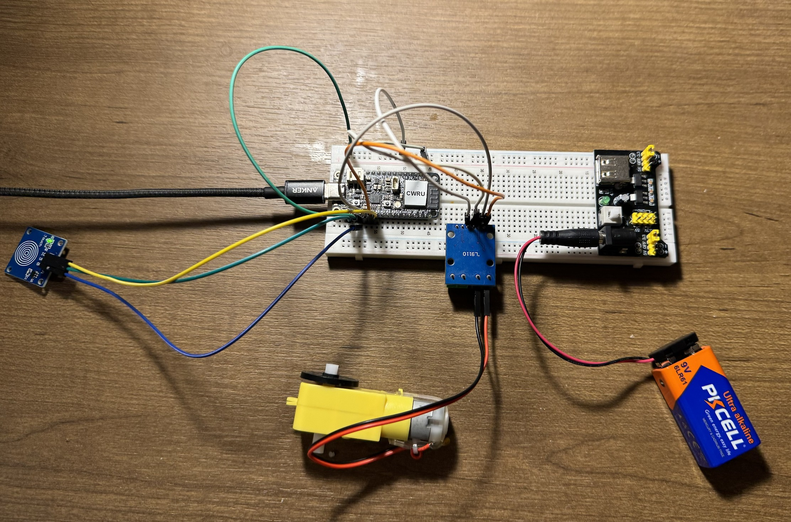
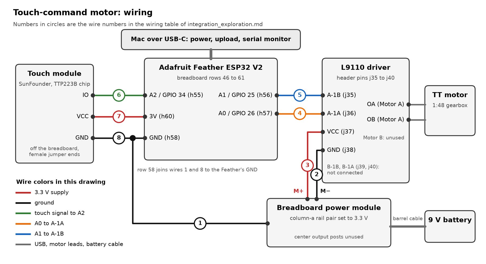

# ECSE 395 Lab 5: Integration Exploration

**Student:** Joe Falkenburg (`jmf277`)

## Assignment overview

This is my last assignment working with the ESP32. In this lab I integrate a sensor and an actuator from the SunFounder Universal Maker Sensor Kit into one system. My sensor is the **touch module** and my actuator is the **TT motor**, driven through the kit's L9110 motor-driver module. Together they make a one-pad motor controller: the number of taps on the pad chooses what the motor does, and a touch while a command is running stops it.

I wrote the program in C++ with the Arduino framework, in Visual Studio Code with the PlatformIO IDE extension on my Mac, and uploaded it over USB-C to an Adafruit Feather ESP32 V2.

## Equipment

Everything I used except the USB-C data cable, which is my own, came in the course lab kit the teaching team issued me for the semester: the Feather ESP32 V2, the touch module, the TT motor with its encoder disk, the L9110 driver, the breadboard and its power module, the 9 V battery with its snap-to-barrel cable, and all of the jumper wires. I did not check out any of the non-kit items that were offered.

## What a reader will find in this repository

Everything for this lab is in the `Lab 5` folder of my course repository, [F26-ECSE395-jmf277](https://github.com/jmf277/F26-ECSE395-jmf277).

| Item | Where | What it is |
|---|---|---|
| This report | [integration_exploration.md](integration_exploration.md) | The system's behavior, the circuit and every wire, how the program works, how to build and upload it, the demonstrations, and the time report and reflection. |
| Folder index | [README.md](README.md) | A short overview with run instructions. |
| Program | [src/main.cpp](src/main.cpp) | The code that integrates the touch module (sensor) with the TT motor and L9110 driver (actuator). Every comment line starts with `jmf277`. |
| Build configuration | [platformio.ini](platformio.ini) | The `adafruit_feather_esp32_v2` board, the Arduino framework, the platform version, and the 115200-baud serial monitor. |
| Circuit photo | [photos/touch-motor-circuit.jpg](photos/touch-motor-circuit.jpg) | My assembled circuit from above. |
| Wiring diagram | [photos/touch-motor-wiring-diagram.png](photos/touch-motor-wiring-diagram.png) | Every connection, numbered to match the wiring table below. |
| Demonstration videos | [videos/](videos/) | Four clips of the system running, described in [Demonstration videos](#demonstration-videos). |

## Desired behavior of the system

A tap is a touch on the pad that is released within 1 second. After each tap the program waits 0.6 seconds for another one; when that window passes, the number of taps is the command:

- When the touch sensor registers one tap, the program drives the TT motor forward at full power for 3 seconds, then stops it.
- When it registers two taps, the program drives the motor in reverse for 3 seconds, then stops it.
- When it registers three taps, the motor swings back and forth: forward for 1 second, stopped for 0.5 seconds, reverse for 1 second, stopped for 0.5 seconds, repeating until the pad is touched again. If nobody touches it, it stops by itself after 20 seconds.
- When the sensor detects a touch while a command is running, the motor stops at once. That touch does not count as a tap, and new taps count only after the finger lifts.
- Four or more taps do nothing, and neither does a hold longer than 1 second; a hold also clears any taps counted before it.

The Feather's built-in RGB light (its NeoPixel) shows what the program is doing. It is off while the program waits for taps and white while a finger is on the pad, so each tap shows as a white flash. It is green while the motor runs forward, blue in reverse and purple during the back-and-forth. It turns red when a touch stops the motor, when four or more taps are ignored, and when a hold passes 1 second. When a run ends by itself, or the back-and-forth reaches its 20-second limit, the light goes off. The serial monitor prints every tap, command and stop with a time stamp.

## Steps to complete this lab

### (a) Setup and preparation

#### Sensor: SunFounder touch module

The module has three pins, IO, VCC and GND. Its chip, a TTP223B, senses a finger through the pad's change in capacitance and drives IO HIGH while the pad is touched and LOW otherwise. The chip drives the line both high and low itself, so the pin reading it needs no pull resistor.

Three timing facts from the TTP223 datasheet matter here. The chip needs about 0.5 seconds after it powers up to calibrate, and the pad should not be touched then; this is why the program ignores the pad for its first second. After about 12 seconds without a touch, the chip drops into a low-power mode in which it takes up to 0.22 seconds to respond. Once it detects a touch, it switches to a fast mode that responds within 0.06 seconds and stays there until about 12 seconds after the finger lifts. Because the first touch after a quiet spell can register late, the commands are counted in taps, and the only time limit on a single touch is a generous 1 second.

#### Actuator: TT motor with the L9110 driver

The TT motor is a DC motor with a 1:48 gearbox, rated for 3 to 6 V. It draws more current than an ESP32 pin can supply, so the L9110 module sits between them. Each of the module's two channels is its own L9110S chip, an H-bridge that connects the motor to the driver's supply in one direction or the other according to its two inputs. I used channel A, as in Lab 4:

| `A-1A` | `A-1B` | Motor A |
|---|---|---|
| HIGH | LOW | Forward (the state SunFounder's truth table calls clockwise) |
| LOW | HIGH | Reverse |
| LOW | LOW | Stopped; the driver pulls both motor terminals low, which brakes the motor |

Which physical direction counts as forward depends on the order of the motor's two wires in the Motor A terminal block; swapping them swaps forward and reverse.

#### Checking the pairing against the rules

The handout does not allow sensor and actuator combinations that already appear on SunFounder's website. The touch module and the TT motor are not on the handout's list of excluded combinations, and none of the projects in SunFounder's Universal Maker Sensor Kit documentation uses them together. The touch module's only combined project there is "Touch toggle light", which pairs it with the traffic light module.

#### Choosing the pins

On the Feather ESP32 V2, `A2`, `A3` and `A4` (GPIO 34, 39 and 36) are input-only, while `A0`, `A1` and `A5` can drive outputs. The motor driver's two inputs stay on `A0` (GPIO 26) and `A1` (GPIO 25), where they were in Lab 4. In Lab 3 the touch module used `A1`, but `A1` now drives the motor, so the touch signal moved to `A2` (GPIO 34). GPIO 34 has no internal pull resistors, which is fine here because the TTP223B drives the line both ways.

#### Choosing the power

I kept the motor supply from Lab 4: the kit's breadboard power module on the 9 V battery, with the rail pair that feeds the driver set to 3.3 V, the setting the Lab 4 handout's Figure 2 uses. The power module accepts 6.5 to 12 V at its barrel jack and puts 3.3 V or 5 V on each rail pair, under 700 mA in total. The motor's current flows from the battery through the module and the driver and never passes through the Feather, which runs from the Mac's USB port. The touch module takes its power from the Feather's `3V` pin, so its HIGH output is 3.3 V; the ESP32's pins are 3.3 V pins and are not rated for 5 V. All of the grounds are joined, so the driver reads the Feather's signals and the Feather reads the touch module's signal against the same 0 V.

#### Planning around the motor's speed range

On the 3.3 V rail the motor needs well over half power to start. Part of the rail's voltage is lost inside the L9110S (its datasheet lists 7.6 V out of a 9 V supply on the high side and 0.45 V on the low side at 750 mA), so the motor gets less than the 3.3 V on the rail. In Lab 4, half power (128 out of 255) on this rail did not start the motor at all. So my program does not vary the speed: every command runs the motor at full power, and the commands differ only in direction and timing.

#### Setting up the project

The course template's `Lab 5` folder is already a PlatformIO project for the Feather. In [platformio.ini](platformio.ini) I pinned the platform to `espressif32@7.1.0`, the version I used in Labs 3 and 4 (it provides Arduino core 2.0.17), and set `monitor_speed = 115200` to match the program's `Serial.begin(115200)`.

### (b) In-class task: building the integration

#### Circuit



In the photo the breadboard lies on its side, with the power module at the right end, the row numbers increasing to the left, and the column-a side along the top edge.



##### Breadboard layout

The breadboard's rows are numbered from the power-module end, and each row has two separate groups of five connected holes, columns a to e and columns f to j, on either side of the center gap. Positions such as h55 name breadboard holes; each pin's GPIO number is given next to it.

- Feather ESP32 V2: straddles the center gap, with its 12-pin header in b46 to b57 and its 16-pin header in h46 to h61. Its USB-C connector points toward the far end of the breadboard, away from the power module. The pins this circuit uses are `A2` (GPIO 34) at h55, `A1` (GPIO 25) at h56, `A0` (GPIO 26) at h57, `GND` at h58 and `3V` at h60. The position at h59 is unused, and `RST` is at h61.
- L9110 driver: its six header pins sit in j35 to j40: `A-1B` at j35, `A-1A` at j36, `VCC` at j37, `GND` at j38, and the two unused channel-B inputs at j39 and j40. The module's pins stick out of its component side, so it sits flipped over with its back facing up, and its body and green terminal blocks hang past the column-j edge of the breadboard.
- TT motor: its two leads sit in the driver's two Motor A screw terminals, one lead per terminal. Motor B is unused, and neither motor lead touches a breadboard rail.
- Touch module: sits off the breadboard. Its three pins, IO, VCC and GND in that order, take the female ends of three jumpers whose male ends go into the breadboard.
- Power module: plugs into the breadboard's end, next to row 1, with the 9 V battery on its barrel jack. It feeds the driver through the rail pair on the column-a side, whose selector is set to 3.3 V. In the table below, M+ is that positive rail and M− is the negative rail beside it. The module's center output posts are unused.

##### Wiring table

The jumpers' colors do not matter; these are their ends.

| Wire | Type | One end | Other end | What it connects |
|---|---|---|---|---|
| 1 | Male to male | M−, the last hole at the USB end | i58 | Supply ground to the Feather's `GND` (h58) |
| 2 | Male to male | M−, beside row 51 | i38 | Supply ground to the driver's `GND` (j38) |
| 3 | Male to male | M+, beside row 46 | i37 | The 3.3 V rail to the driver's `VCC` (j37) |
| 4 | Male to male | i57 | i36 | Feather `A0` (GPIO 26) to the driver's `A-1A` |
| 5 | Male to male | i56 | i35 | Feather `A1` (GPIO 25) to the driver's `A-1B` |
| 6 | Female to male | Touch module `IO` | i55 | Touch signal to Feather `A2` (GPIO 34) |
| 7 | Female to male | Touch module `VCC` | i60 | Feather `3V` to the touch module's power |
| 8 | Female to male | Touch module `GND` | j58 | Touch module ground to the Feather's `GND` |

Each jumper lands in the same f-to-j group as the pin it serves, which is how a jumper at i57 reaches the Feather's pin at h57, for example. Row 58 is where the grounds meet: the Feather's `GND` pin at h58, wire 1 from the supply's ground rail at i58, and wire 8 from the touch module at j58 are all in the same connected group, so no extra jumper is needed there.

##### How the wiring works as a circuit

Wires 4 and 5 carry the Feather's commands to the driver: `A0` sets `A-1A` and `A1` sets `A-1B`, and the pair chooses forward, reverse or stop. Wire 6 carries the touch module's HIGH or LOW to `A2`.

Wire 3 brings the power module's 3.3 V rail to the driver, which passes it on to the motor through the Motor A terminals. Wire 7 powers the touch module from the Feather's own 3.3 V regulator. The Feather's `3V` pin and the power module's rail are never connected to each other, so the motor's current never reaches the Feather.

Wires 1, 2 and 8 tie the power module, the driver, the touch module and the Feather to one ground. A signal is a voltage measured against ground, so without wire 1 the driver would read the Feather's `HIGH` against a different 0 V than the Feather's.

#### Program

The whole program is [src/main.cpp](src/main.cpp), with every statement commented and every comment line starting with `jmf277`. [How the system works](#how-the-system-works) explains it section by section.

#### Running it

I uploaded the program, opened the serial monitor, switched the power module on, and went through every command, including stopping a run partway and trying input that should be ignored. The system behaved as designed each time. Every tap flashed the light white. One tap ran the motor forward for 3 seconds with the light green, and two taps ran it in reverse for 3 seconds with the light blue; when a run finished, the motor stopped and the light went off. In the serial monitor each command started 0.600 seconds after my last tap, and each run I let finish ended 3.000 seconds after it started. A touch partway through a run stopped the motor at once and turned the light red. Three taps started the back-and-forth with the light purple, its steps changing every 1.0 and 0.5 seconds, and a touch during it stopped the motor and turned the light red. Four taps did nothing but flash the light red, and holding the pad longer than a second turned the light from white to red and cleared the count. The serial log shows no brownout resets while the motor ran.

### (c) Documentation

- I wrote this report and the [folder README](README.md), and commented the program.
- The circuit photo, the wiring diagram and the four demonstration videos are in the `photos` and `videos` folders, linked above.
- The last step is committing and pushing everything to my GitHub repository, attaching the demonstration videos to a comment on the Lab 5 Canvas assignment, and submitting the repository link on Canvas.

## How I uploaded the code to the ESP32

### Tools used

| Setting | Configuration |
|---|---|
| Computer | Mac (macOS) |
| Editor | Visual Studio Code with the PlatformIO IDE extension |
| Project folder | `Lab 5`, opened through **PlatformIO Home → Open Project** |
| Board | `adafruit_feather_esp32_v2` (Adafruit Feather ESP32 V2) |
| Platform | `espressif32@7.1.0`, which provides Arduino core 2.0.17 |
| Framework | Arduino |
| Libraries | None to install. The NeoPixel is driven by `neopixelWrite()`, which is built into the ESP32 Arduino core. |
| Serial baud rate | `115200` in the program and as `monitor_speed` |
| Connection | USB-C data cable from the Mac to the Feather, for power, upload and the serial monitor |

### Upload process

1. Build the circuit from the wiring table with the USB cable unplugged and the power module switched off.
2. Open the `Lab 5` folder as a PlatformIO project in VS Code.
3. Plug the Feather into the Mac with the USB-C data cable, keeping fingers off the touch pad while it powers up so the touch chip can calibrate.
4. Close any serial monitor that is using the board, then click **Upload** (the → arrow in the blue status bar), or run **Project Tasks → adafruit_feather_esp32_v2 → General → Upload**. PlatformIO compiles the program, finds the board's USB serial port and ends with `SUCCESS`.
5. Open the serial monitor with the plug icon; `platformio.ini` sets it to 115200 baud. Pressing the Feather's **RESET** button restarts the program, which prints its command list and then `Ready: tap 1, 2 or 3 times`.
6. Switch the power module on. Its green LED lights, and the motor stays still until a command.

The same steps from a terminal in the `Lab 5` folder:

```sh
pio run -t upload
pio device monitor
```

If the upload cannot connect, close any serial monitor, check that the cable carries data and not only power, press **RESET** and upload again. Stop the monitor with **Control+C** before the next upload.

## How the system works

Each pass through `loop()` reads the pad, lets the handler for the current mode act, and ends with a 1 ms rest. Every step is timed by comparing `millis()` against a saved start time, so the program checks the pad about 1000 times a second even while the motor runs, and a touch can stop the motor in the middle of a command. My Lab 4 rotate program timed its steps with `delay()` and could not do that.

### Start-up

`setup()` sets both driver inputs LOW before anything else, so the motor cannot start by itself, and sets `A2` as an input. It prints the command list to the serial monitor, then waits 1 second before reading the pad, which covers the touch chip's calibration time after power-up. If a finger is already on the pad at that point, the program waits for it to lift before counting taps.

### Reading the pad

Each pass reads `A2` with `digitalRead()`. A new reading has to hold for 30 ms before the program accepts it (a debounce), which filters out glitches. The accepted changes, a touch beginning and a touch ending, drive everything else.

### Counting taps

`handleTaps()` runs while the motor is stopped. When a touch begins, it notes the time and turns the light white. If the finger lifts within 1 second, the touch counts as a tap, the light goes off, and a 0.6-second window starts for the next one. A touch that reaches the pad just as the window closes gets its 30 ms to settle and still joins the count. When the window closes with no new touch, `startCommand()` acts on the count: 1, 2 or 3 start a command, and a higher count flashes the light red and leaves the motor stopped. A touch held past 1 second turns the light red, clears the count and is ignored until the finger lifts.

### Running a command

`setMotor()` sets the two driver inputs with `digitalWrite()`. Forward is `A-1A` HIGH and `A-1B` LOW, reverse is the opposite, and stop is both LOW. When it switches, the function lowers one input before raising the other, so the two are never HIGH together. `handleRun()` times the 3-second forward and reverse runs. For three taps, `handleSwing()` steps through a four-entry table (forward 1 s, stop 0.5 s, reverse 1 s, stop 0.5 s) and repeats it, so the motor always comes to a stop before it changes direction, and it ends the back-and-forth after 20 seconds if the pad is never touched.

### Stopping

A touch accepted while any command is running, including during the stops inside the back-and-forth, sets both inputs LOW at once and turns the light red. That touch is not counted as a tap; the program waits for the finger to lift and then goes back to counting taps. The red light stays on for at least half a second so it can be seen, unless a new touch starts sooner.

### The light

`neopixelWrite()` sends a red, green and blue level to the Feather's built-in NeoPixel on GPIO 0. Every color uses a level of 40 out of 255, about a sixth of full brightness. `handleTaps()` turns the light white when a touch begins and off when a tap ends; `startCommand()` sets green for forward, blue for reverse and purple for the back-and-forth; `showRed()` handles every red; and `handleRun()` and `handleSwing()` turn the light off when a run ends by itself or the back-and-forth reaches its limit.

### The serial monitor

After the start-up lines, every line starts with the time since start-up, for example `[   4.217 s]`:

| Message | Meaning |
|---|---|
| `Ready: tap 1, 2 or 3 times` | Start-up is finished and taps count. |
| `Pad is being touched: lift your finger before tapping` | A finger was on the pad when start-up finished; taps count once it lifts. |
| `Tap 1`, `Tap 2`, ... | A touch was released within 1 second and counted. |
| `1 tap: forward for 3.0 s` | One tap started a forward run. |
| `2 taps: reverse for 3.0 s` | Two taps started a reverse run. |
| `3 taps: back and forth until the pad is touched (20.0 s limit)` | Three taps started the back-and-forth; the lines `forward`, `pause`, `reverse` and `pause` follow as its steps change. |
| `Run finished: motor stopped` | A 3-second run ended on its own. |
| `Touch: motor stopped` | A touch stopped a running command. |
| `Pad released: ready for taps` | The finger lifted after a stop, a hold, or a touch at start-up, and taps count again. |
| `4 taps: not a command, ignored` | Four or more taps: nothing happens. |
| `Held longer than 1.0 s: ignored, tap count cleared` | A hold was rejected. |
| `20.0 s limit reached: motor stopped` | The back-and-forth ran for 20 seconds without a touch. |

## Demonstration videos

The circuit photo and wiring diagram are in [Circuit](#circuit). These four clips show the system running:

| Clip | Length | What it shows |
|---|---|---|
| [videos/demo-1-one-two-four-taps.mp4](videos/demo-1-one-two-four-taps.mp4) | 21 s | The setup, then one tap (a white flash, then forward for 3 s with the light green), two taps (reverse for 3 s with the light blue), one tap again, and four taps, which the program ignores with a red flash. |
| [videos/demo-2-run-stopped-then-three-taps.mp4](videos/demo-2-run-stopped-then-three-taps.mp4) | 15 s | One tap starts a forward run (green) and a touch stops it partway (red); then three taps start the back-and-forth (purple). |
| [videos/demo-3-long-hold.mp4](videos/demo-3-long-hold.mp4) | 12 s | A hold longer than 1 s: the light goes from white to red, the tap count clears, and nothing moves. |
| [videos/demo-4-three-taps-touch-stop.mp4](videos/demo-4-three-taps-touch-stop.mp4) | 13 s | Three taps start the back-and-forth (purple), and a touch stops it: the motor stops and the light turns red. |

I also attach the same clips to a comment on the Lab 5 Canvas assignment.

## Time reporting and reflection

### 1. How long did it take you to complete this assignment?

5 hours.

### 2. What level of difficulty would you associate with this assignment?

- [x] Low
- [ ] Medium
- [ ] High

### 3. If you associated medium/high difficulty with this assignment, what aspect did you find the most difficult?

N/A, because I rated the difficulty low.

### 4. How comfortable do you currently feel with the course content?

Comfortable.

### 5. Do you have any additional information or feedback you would like to share with the instructors?

Three things about the Lab 5 materials. First, the list of excluded sensor and actuator combinations matches SunFounder's ESP32 projects, Lessons 35 to 43, but the same website also pairs the speed sensor with the TT motor (Lesson 7 in the Arduino and Raspberry Pi sections), the MPU6050 and the joystick with the OLED screen (Arduino Lessons 52 and 53), the button with the RGB LED (ESP32 Lesson 47), and the DHT11 with the RGB LED (ESP32 Lesson 48). Saying whether those pairings are excluded too would help. Second, the troubleshooting section of the course template's Lab 5 README says to check `monitor_speed = 0` in `platformio.ini`; the monitor has to match the baud rate the program uses, 115200 in mine, so a value of 0 would not work. Third, Table 1 of the handout lists the TT motor with the L9110 driver as analog, the DS18B20 as PWM and the SG90 servo as digital, while the L9110 takes digital or PWM inputs, the DS18B20 uses a one-wire digital protocol and the servo takes PWM pulses. Pages 2 to 5 of the handout are also headed "Lab #4".

## References

- The **ECSE 395 Lab #5 handout** (Dr. Alexis E. Block and Michael Fu, September 23, 2026) and the Lab 5 Canvas assignment and rubric.
- SunFounder Universal Maker Sensor Kit documentation: the [touch sensor module](https://docs.sunfounder.com/projects/umsk/en/latest/01_components_basic/22-component_touch.html), [TT motor](https://docs.sunfounder.com/projects/umsk/en/latest/01_components_basic/34-component_ttmotor.html), [L9110 motor driver module](https://docs.sunfounder.com/projects/umsk/en/latest/01_components_basic/37-component_l9110.html) and [power supply module](https://docs.sunfounder.com/projects/umsk/en/latest/01_components_basic/39-component_power.html) pages, and the project lists for the [ESP32](https://docs.sunfounder.com/projects/umsk/en/latest/03_esp32/esp32.html) and [Arduino](https://docs.sunfounder.com/projects/umsk/en/latest/02_arduino/arduino.html), including [Lesson 40: Touch toggle light (ESP32)](https://docs.sunfounder.com/projects/umsk/en/latest/03_esp32/esp32_lesson40_touch_toggle_light.html).
- Tontek, [TTP223-BA6 datasheet](https://www.electrokit.com/upload/product/41016/41016201/TTP223.pdf): push-pull output, active high by default, about 0.5 s after power-up before the pad responds, and response times of 220 ms in low-power mode and 60 ms in fast mode.
- ASIC, [L9110 datasheet](https://www.elecrow.com/download/datasheet-l9110.pdf): 2.5 to 12 V supply, 800 mA per channel, a HIGH input of at least 2.5 V, and the output levels at 9 V and 750 mA.
- Adafruit, [Adafruit ESP32 Feather V2 pinouts](https://learn.adafruit.com/adafruit-esp32-feather-v2/pinouts): pin numbers, the input-only analog pins, and the NeoPixel on GPIO 0.
- [PlatformIO: VS Code integration](https://docs.platformio.org/en/latest/integration/ide/vscode.html) and [project configuration](https://docs.platformio.org/page/projectconf.html).
