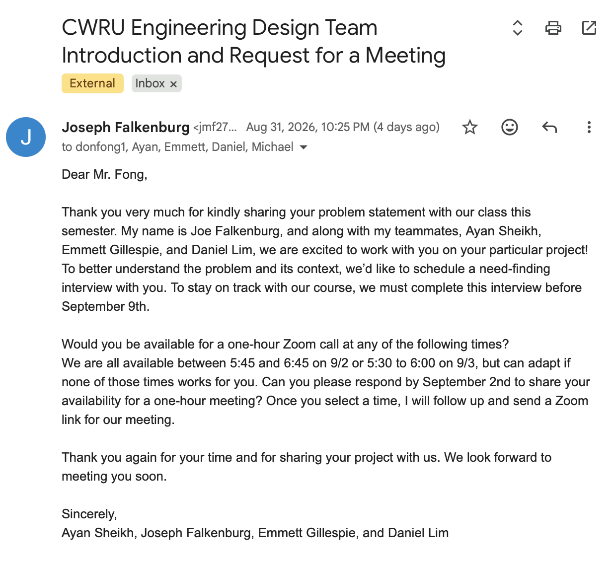

# Week 2 Project Log

**Student:** Joe Falkenburg

**Team role:** Secretary, as designated in our team contract

**Teammates:** Ayan Sheikh, Emmett Gillespie, and Daniel Lim

**Project:** Bird-feeder project

**Stakeholder:** Don Fong

**Reporting period:** August 31 through September 4, 2026

## Individual Contributions

### 2026-08-31 at 10:25 PM: Stakeholder Introduction Email Sent

Ayan Sheikh drafted the introductory email, and all four team members reviewed it and provided input. I made the final changes and sent the email to Don Fong on behalf of our team at 10:25 PM on August 31. The email introduced our team, relayed our availability, and requested a need-finding interview.

### By 2026-08-31: Team Contract Review and Signature

I provided comments on the team contract and signed it before submission. Our team designated me as secretary in the contract. This continued the preliminary contract discussions from Week 1. The team completed and submitted the contract under the extension associated with my late arrival after finishing my Spring/Summer co-op.

### Between 2026-08-31 and 2026-09-03: Stakeholder Meeting Coordination

I facilitated the scheduling correspondence with Don on behalf of our group. After relaying our availability in the introductory email, I responded when Don proposed a meeting time and sent out the meeting invitation. This coordination resulted in our need-finding interview on September 3 at 6:00 PM.

### 2026-09-03: Need-Finding Interview and Meeting Minutes

I attended the stakeholder meeting beginning at 6:00 PM, took an active role in the discussion, asked questions, and contributed insights. In my role as team secretary, I also took the meeting minutes included below.

## Team Activities and Milestones

- **2026-08-31 at 11:39 PM:** Our team submitted the completed team contract.
- **Between 2026-08-31 and 2026-09-03:** Our team arranged the need-finding interview with Don, with me handling the scheduling correspondence and sending the meeting invitation on the group's behalf.
- **2026-09-03 at 6:00 PM:** All four team members met with Don. We began on Zoom and moved to FaceTime because of connection and video problems. Everyone contributed to the conversation, including follow-up questions and clarifications that built on other team members' questions. We discussed Don's needs and watched him demonstrate the feeder, its surroundings, and its refill process.

## 2026-09-03: Stakeholder Need-Finding Meeting Minutes

**Start time:** 6:00 PM

**Platforms:** Zoom, then FaceTime

**Attendees:** Don Fong, Joe Falkenburg, Ayan Sheikh, Emmett Gillespie, and Daniel Lim

**Minutes recorded by:** Joe Falkenburg, team secretary

### Participation and Attribution

The interview was a dynamic, collaborative discussion. All four team members contributed questions, observations, follow-up questions, and clarifications, often building on one another's points.

While taking minutes, I did not consistently record which team member raised each question or idea. Rather than selectively credit some contributions while overlooking others because of incomplete recall, these minutes document the discussion collectively. My separately identifiable responsibilities, including stakeholder correspondence, sending the invitation, and taking minutes, are recorded in the individual-contribution section above.

In future meetings, I will make a more deliberate effort as secretary to record who raises key questions and ideas alongside the substance of the discussion.

### 1. Purpose of the Meeting

We met with Don to understand the problem behind his request for a bird feeder that dispenses food for birds rather than deer. We discussed his current feeder, how he uses it, the seed disappearing overnight, and what he would want from a solution. Don also showed us the feeder, its surroundings, and how he refills it.

We started on Zoom, but connection and video problems interrupted the call during a storm. Don switched to cellular service, and we moved to FaceTime so he could show us the feeder.

### 2. The Feeder and Its Importance to Don

A neighbor recently gave Don the feeder after his father-in-law passed away. It was a gift in his memory, and the neighbor wrote a personal message about his father-in-law on one of the glass side panels. The feeder has sentimental value, so preserving its appearance and the message matters alongside solving the feeding problem.

Don started using the feeder after receiving it and enjoys seeing the birds come to it. He feeds them practically every day during the summer. Most visitors are small, sparrow-sized birds, but he also sees an occasional cardinal, which is noticeably larger. We asked about the different birds because they are not all the same size. Don does not know their weights.

### 3. Current Setup and Feeder Operation

#### Location and Access

The feeder hangs outside a ground-floor window at Don's home. Its top hook hangs from a metal support normally used for plants or flowers. Don estimates the feeder is about five feet above the ground, around chin height when he stands outside. He would like to keep it at roughly its current four-to-five-foot height.

He can reach the feeder by opening the window from inside the house. This lets him take it down, bring it inside to refill it, and hang it back up without going outdoors. He can also reach it while standing outside. We asked how much the existing setup could change and how closely a solution should fit around the way he already uses it.

There are somewhat thorny bushes underneath the feeder. Don had thought these might discourage deer, but a deer could potentially reach over them with its neck. The metal support rod is narrow, which also affects how another animal might reach the feeder.

#### Seed Storage and Feeding

The feeder is a passive, gravity-fed system. Seed sits in a central compartment with glass side panels and comes out through four openings at the bottom. The seed's own weight pushes it out toward the feeding edge. As birds remove seed from the edge, more moves down from the compartment to replace it.

Birds perch on the lip to eat. Don estimated the feeding edge at a little over an inch. The feeder keeps replenishing the exposed seed as it is taken, so an animal that can reach that edge can potentially keep eating until the central compartment is empty, rather than just taking the seed already sitting outside it.

#### Refilling

Don showed us the small latch that opens the feeder. He brings the feeder inside, opens it, and pours seed into the central compartment. The seed then moves out through the bottom openings without any powered mechanism. Seeing the latch, hook, and feeding openings helped us understand how an addition would fit around the existing feeder and its refill process.

### 4. Daily Routine, Overnight Loss, and the Current Workaround

The birds often eat almost the entire feeder's contents during the day. When some seed remains, Don generally waits for it to empty rather than immediately topping it up.

When he leaves the feeder outside overnight with seed still in it, the remaining seed is gone by morning. He notices this when he opens the shades. He does not think the birds are eating it at night and suspects another animal is emptying it.

To avoid putting out a fresh supply for the deer overnight, Don does not rehang the feeder for the night after bringing it inside and refilling it. A partly full feeder can still be left outside, which is when he has noticed the remaining seed disappear. Keeping the refilled feeder indoors overnight avoids exposing the fresh supply but does not stop an animal from taking seed that remains outside.

Don enjoys the daily feeding routine now, but he is not sure he will want to open the window every day once the weather turns cold. He raised winter use as something for us to consider, especially because refilling and rehanging the feeder still require him to open the window.

### 5. Suspected Animals and How They May Be Taking the Seed

#### Deer

We asked whether Don had seen deer eating from the feeder or whether other animals could be responsible. His wife has seen deer in the backyard, and there are many deer in the neighborhood. Don has not personally seen a deer feeding from this feeder and has not set up a camera to watch it.

Don thinks a deer may reach over and lick seed off the feeding lip while standing on the ground. As it removes the exposed seed, more comes out of the central compartment. In that situation, the deer could empty the feeder without putting much, if any, weight on the perch.

The important distinction in his explanation is how the animal uses the feeder, not just how large the animal is. A bird lands on the lip and puts its weight on it. A deer reaching in with its tongue may not put weight on the feeder at all.

#### Squirrels, Chipmunks, and Other Access Routes

We also discussed squirrels and chipmunks. Don thinks the narrow support rod and the awkward route onto the hanging feeder make their access less likely. We also discussed whether an animal such as a squirrel trying to perch on the feeder could tip it, unlike the small birds that normally use it.

We asked whether an animal could climb the side of the house and reach the feeder from the windowsill. Don acknowledged that possibility, although he has not seen it happen. The bushes and narrow support make access more difficult but do not rule out other animals.

We will start by investigating the suspected deer problem while keeping other animal interactions in mind.

#### Comparison with Existing Weight-Triggered Feeders

Don knows of feeders that close a trapdoor or feeding opening when a heavier animal, such as a squirrel, lands on them. He sees his situation as almost the opposite: the bird applies a small load, while the deer may take seed without applying a load. A mechanism that only closes under a heavy load would not respond to the kind of feeding he suspects is happening here.

### 6. Possible Approaches and Appearance

#### Don's Initial Idea

Don suggested stopping the seed from continuing to come out when it is being removed without a bird perched on the feeder. When a small, lightweight bird lands on the lip, the mechanism would open or allow feeding again.

He described the condition to look for as seed continuing to be taken even though there is no bird's weight on the feeder. While showing us the top hook, he also wondered whether we could sense something pulling on the feeder.

We asked whether he would consider approaches other than a weight-based system. He is open to them. Weight sensing was his initial idea, not a method he needs us to use. Another approach is welcome if it solves the problem. We did not choose a mechanism during this meeting.

#### Appearance and Placement

Don does not want a solution that makes the feeder look clunky or leaves equipment visibly attached to the outside without fitting its appearance. He suggested putting something underneath, where it could be less noticeable.

The feeder has a rustic, black-metal look. An addition on top could also be acceptable if it keeps that appearance. The underside is therefore one option, not the only acceptable location.

We discussed protecting the memorial panel and avoiding an addition that would deface the message or make the gift unattractive. We also raised the possibility of placing equipment on the support pole or in the area around the feeder rather than directly on the feeder itself. That could allow us to address the unwanted animal without altering the feeder as much.

A deterrent was another general possibility we discussed, with the same goal of responding to the unwanted animal while allowing birds to feed. We did not settle on a particular deterrent or way to detect the animal.

We encouraged Don to keep sharing specific preferences, ideas, and early reactions, even when they are not fully worked out. We want to avoid building something that solves the problem as we understand it but does not fit what he actually wants to use.

### 7. Power, Weather, and Everyday Use

#### Rechargeable Power

Don expects a powered solution may need a battery and would prefer something rechargeable, ideally through USB. We asked about a rechargeable battery versus a replaceable coin cell and what was behind his preference.

His reason was convenience: he would rather charge the device than have to find and replace the correct coin-cell battery. Replacing one would not be especially difficult for him, but obtaining the replacement would be another task.

He connected the charging idea to his existing habit of bringing the feeder inside to refill it. Recharging could fit into that routine, particularly when the feeder is already staying inside overnight.

#### Outdoor Exposure

We discussed waterproofing or water resistance because the feeder and any equipment mounted with it would be exposed to rain. The storm during the call made this an immediate concern. The feeder was wet, and Don planned to leave it inside to dry.

### 8. Don's Background and Comfort with Technology

We asked Don about himself to better understand who will use the prototype and what would be comfortable for him, beyond the feeding problem alone.

Don studied electrical engineering at Case and works at NASA. He knows Professor Fu through their church, which is how he became involved in the project. He also hosts his church's Zoom channel and normally uses Zoom on his laptop.

He has two sons. His older son graduated from Case a few years ago and also studied electrical engineering. Don was glad to connect with engineering students at Case.

Don made clear that his engineering background affects what he would be comfortable using. He would not be put off by a more involved solution that needs configuration, adjustments, or additional controls. We asked whether he would be comfortable setting up something on or near the feeder rather than needing a completely plug-and-play device, and he agreed.

We do not need to assume that technical setup would be a barrier for him. He is comfortable with a device that takes some involvement to configure, while still wanting it to fit the feeder's appearance and be convenient to maintain.

### 9. Feeder Model and Measurements

We asked for the exact model or the store it came from so that we can design something that fits. Don does not have that information readily available because the feeder was a gift. We had a similar-looking feeder to compare it with, but still need to identify the exact model or work from measurements of his feeder.

We can work around the missing purchase information rather than have Don ask the neighbor where the gift came from. Asking about it could be awkward, particularly if it led to discussing its price.

Measurements of the major dimensions, including the seed compartment, would let us establish the fit directly and could also help us identify the model. We emphasized that we do not want to design and build an attachment only to find that it does not fit his feeder.

We asked Don to get those measurements when convenient and once the weather improves; there is no need to go outside during the storm. Taking measurements in person is also an option. We did not arrange a visit.

### 10. What We Will Build and How Don Will Be Involved

#### Focus on Don's Situation

Don asked whether the project needs to produce something that can be mass-produced or used by a larger population. We explained that our focus is on understanding his particular problem, documenting his needs, and building a prototype that addresses them. A general solution for everyone with a bird feeder would not necessarily be the best solution for him.

We discussed the work as a semester-long process. We want to make a measurable improvement to the problem, while recognizing that the prototype may not resolve every need. Don was comfortable with that approach.

Automatic or remote refilling came up as an idea for a later phase or senior project, especially in connection with avoiding the need to open the window in winter. We are not taking on automatic refilling as part of the current work.

#### Testing and Feedback

We will handle the internal engineering checks, including testing components and subsystems and working through technical test cases. Don does not need to be involved in every technical detail.

We do need his input on whether the prototype works for him. That includes its function, shape, appearance, and even color, not just whether a mechanism operates. Our own testing cannot replace his judgment about whether he would be satisfied with it.

We will keep him updated and come back to him when we have a prototype ready for useful feedback. We will use that feedback to revise the design and repeat the process. Don agreed to this and asked us to reach out when we are ready to meet again.

### 11. Action Items and Next Meeting

Don will provide the feeder measurements when convenient and when the weather permits. We will use the measurements and what he showed us to work out the fit and investigate possible approaches.

Our team will handle scheduling the next meeting, with me coordinating. We agreed to give Don about a week's notice and offer a couple of possible times.

Weekdays after about 5:00 PM generally work for Don. Saturday mornings may also work; we will check his availability when arranging the next meeting.

We did not set a date. We will reach out once our progress or the course milestones make the timing of the next conversation clear, or when we need his feedback to move forward.