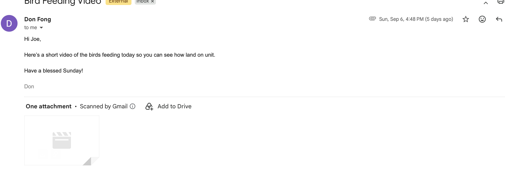
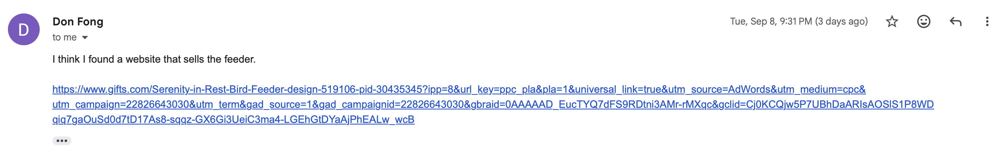
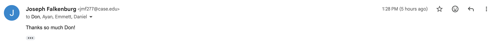
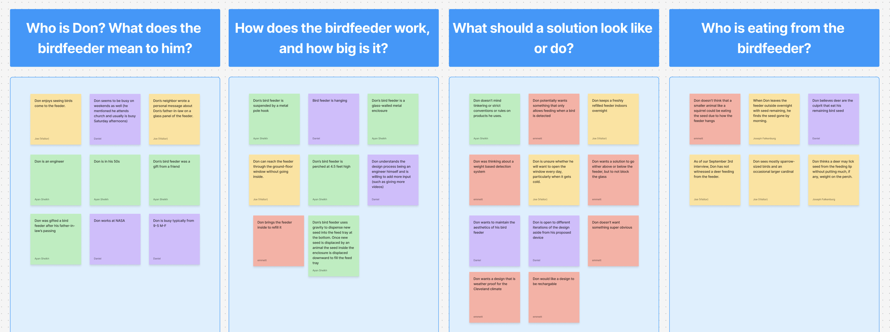

# Week 3 Project Log

**Student:** Joe Falkenburg

**Team role:** Secretary

**Teammates:** Ayan Sheikh, Emmett Gillespie, and Daniel Lim

**Project:** Bird-feeder project

**Stakeholder:** Don Fong

**Reporting period:** September 5 through September 11, 2026

## Individual Contributions

### 2026-09-06 through 2026-09-11: Stakeholder Materials and Team Communication

- **2026-09-06 at 4:48 PM:** Don emailed me a short video of birds feeding so we could see how they land on the feeder.
- **2026-09-06:** I forwarded Don's video email to the rest of the team because he had sent it only to me.
- **2026-09-08 at 9:31 PM:** Don emailed me a link to a website that he thought sold his feeder. Verified everything checked out.
- **2026-09-09:** I forwarded Don's feeder-link email to the rest of the team because he had sent it only to me.
- **2026-09-11 at 1:28 PM:** I sent Don a thank-you email for the feeder link, including Ayan, Emmett, and Daniel in the reply so the whole team will be included in the email thread for future correspondance.

The screenshots below show Don's original emails and my thank-you reply. The thank-you screenshot shows the 1:28 PM send time and all four recipients.

### 2026-09-09 at Approximately 3:00 PM: Informal Assignment Planning

After class, I participated in an informal team discussion about how to divide the work for the Project Background and Needs Statement assignment. My responsibilities were to contribute eight sticky notes to the Figma board (which was affinity-clustered by Emmett) and write the Project Background section.

### 2026-09-09: Figma Affinity-Clustering Contribution

I ended up contributing nine sticky notes to the Figma board (my original eight plus one additional I thought better suited the board than another, but we kept both). My notes are the ones with names "Joe (Visitor)" and "Joseph Falkenburg" in the screenshot below.

### 2026-09-09: Project Background Writing and Document Review

I wrote the Project Background section of our Project Background and Needs Statement assignment, drawing on my stakeholder interview minutes and recollection to explain Don's situation, the existing feeder and refill routine, the seed-loss problem, and the project scope. I also proofread the other sections, particularly the needs statement one to help reconcile my background section with the similar material in the Needs Statement so the sections worked together as a coherent document.

### 2026-09-11 from 1:00 to 1:30 PM: Internal Team Meeting and Meeting Minutes

I attended our internal team meeting virtually on Google Meet with all four team members present. We reviewed our responsibilities and shared-document workflow, discussed preliminary design directions based on Don's needs, and agreed on how to use our weekly meeting time as we move toward prototyping. In my role as secretary, I recorded the meeting minutes included below, finished them, and distributed them to the team that same day (as of this commit being pushed haha).

## Team Activities and Decisions

- **2026-09-09 at approximately 3:00 PM:** We informally discussed the Project Background and Needs Statement assignment after class and divided the work.
- **2026-09-11:** We reviewed the team contract and agreed to split responsibility for meeting agendas: Ayan (team lead) and I will work together on agendas for internal meetings, and I will make agendas for meetings with Don. I documented this contract adjustment in the minutes below.
- **2026-09-11:** We agreed to use Google Docs for collaborative writing, with Word available when needed for submission formatting, and to centralize the two existing Word documents in our shared Google Drive.
- **2026-09-11:** We compared a light-and-sound deterrent with automatic nighttime closure, considering the feeder's sentimental value, effects on birds, daytime deer access, mounting, weather exposure, and moving parts. We did not select a final design or mounting arrangement.
- **2026-09-11:** We agreed to keep the one-hour weekly meeting block and hold most future meetings in person around the South Quad because many of us have class before and after, and in person meetings is better than finding a spot to take a call on the quad. The time can support both coordination and prototype work as the project develops.
- **2026-09-11:** I decided to include the whole team in future replies to Don so everyone could receive the correspondence directly.

## 2026-09-09: Reflection on the Guest Lecture on Engineering Standards

On Wednesday, Dr. Snehesh Shrestha from NIST gave a guest lecture on engineering standards: what they are, why they matter, who makes them, and why engineering students should care.

### My Thoughts

It's easy to nod along to "standards matter," and honestly I expected that to be the whole talk and not to take much out of it. What made it land was how example-driven it was. Milk sold at exactly skim, 1%, 2%, and whole; a light bulb being "A-series with an E26 base" instead of something you carry to the store to compare; refrigerators built to countertop depth. I had never really thought about any of it, which was his point. The Nepal milk story was the best version: "why is the milk watery today" is not a conversation anyone has here, because a standard made it unnecessary.

The framing I'll keep is that a standard is a shared agreement on how things are designed, built, tested, measured, and communicated, and that it is not a law. NIST writes them but can't enforce them; but the FDA or the EU can.,, His four buckets (design, safety, performance/test, data/communication) gave me vocabulary I didn't have, and "an engineer who follows standards blindly can still cause harm" was a good reminder that a standard is a floor, not a substitute for judgment.

Some honest feedback though is that the presentation was mostly everyday examples, and the part I actually needed as someone about to write a specs document, who writes standards and how you figure out which ones apply to your project, got squeezed into the last minute. Dr. Block asked exactly that at the end and the answer was "I'll send a list." We could've shifted time from the currency, sheet-music, and rope-knot stuff to that, and I think I would've taken even more away.

### What I Enjoyed and Didn't Enjoy as Much

I enjoyed the USB-C / Apple / EU case the most. It packed the whole argument into one story a lot of us could probably relate to: standards aren't law (no standards body could make Apple drop its proprietary connector), but a third party can enforce one (the EU's 2022 directive), and the "standards kill innovation" myth doesn't hold, since Apple helped shape USB-C and now both Apple and its customers are better off. His list of what we no longer think about (size, shape, orientation, polarity, voltage) is a good summary of what a standard buys you. And everyone has the bag of dead cables.

What I didn't enjoy was mostly the ending. The Mars Climate Orbiter, a $327.6 million NASA mission lost because two teams used different unit systems, was arguably the most important engineering failure in the talk and got about thirty seconds; the "who creates standards" and "why you should care" slides went by too fast. 

### What It Made Me Think About

Our projects! Since part of Wednesday's class was about turning user needs (words) into technical specs (numbers). Dr. Fu discussed how engineering standards are a place to find those numbers, and his "performance and test standards" bucket is the same idea.

- **"Weatherproof" is a word, not a spec LOL.** We've written it in our notes since the storm during the interview with Don. The technical-spec version is an ingress-protection rating (IEC 60529; I need to check whether rain and snow calls for IP65 or IP67 rather than guess) plus an operating temperature range that covers a Cleveland winter. My guess is the rechargeable battery, not the ESP32, is the limiting part, which I want to verify before Monday. This nuanced perspective is something I will really benefit from in the project.
- **Units.** The Mars Climate Orbiter story hit differently since Don works at NASA Glenn. Practically: Don gave us everything in feet and inches (about five feet up, a feeding lip a little over an inch), the breadboard is 0.1-inch pitch, and any enclosure or CAD work will be in millimeters. Four people writing one specs document have to pick pick units once and note what Don's estimates were converted from!
- **Our "internal clock" is LITERALLY his NTP example.** One of our two options for the nighttime closure is an internal clock. The ESP32 doesn't keep time through a power loss on its own, so that really means syncing over Don's Wi-Fi with NTP, the exact mechanism he described down to measuring the round-trip delay. I had been treating clock vs. light sensor as either/or; they might actually be complementary.
- **We need our own test metrics.** "The deterrent works" and "birds still feed" have to become numbers: overnight seed loss below some percentage of a fill, false triggers on birds below some rate, response within some seconds of a deer entering the area, battery life that fits Don's refill routine. His point that you can't compare two pose-estimation algorithms until they define keypoints the same way is our problem too: without a shared metric, deterrent vs. nighttime closure is just preferences. And no spec sheet will tell us whether a sound that bothers deer also bothers sparrows; that's on us to test.
- **Invisible standards as a design goal.** "Standards are working when you don't notice them" is basically what Don told us about the feeder: it's a memorial gift, he doesn't want something clunky bolted onto it, and our first key insight was to maintain its visual integrity. The best version of our project is one Don doesn't notice; the seed just stops disappearing.
- **Annnnd one small one:** Don wants USB-rechargeable, and the same week our Lab 3 handout warned us to make sure our USB-C cable actually supports data transfer. A connector standard covers the plug, not everything behind it, which was his tolerance point in miniature.

## 2026-09-11: Internal Team Meeting Minutes

**Time:** 1:00–1:30 PM · **Platform:** Google Meet · **Minutes recorded by:** me (Joe Falkenburg), team secretary

| Meeting date | Team member | Attendance |
| --- | --- | --- |
| 2026-09-11 | Joe Falkenburg | Present |
| 2026-09-11 | Ayan Sheikh | Present |
| 2026-09-11 | Emmett Gillespie | Present |
| 2026-09-11 | Daniel Lim | Present |

### 1. Purpose of the Meeting

We reviewed our roles, how we will manage shared documents, and how to use our weekly meeting time as the project moves toward prototyping. We also discussed possible approaches to the seed loss at Don's feeder, building on the stakeholder interview and our work together on the Project Background and Needs Statement we'd completed 2 days earlier.

### 2. Roles and Division of Work

We went through the submitted team contract so everyone understands the responsibilities across the team, not just their own role. These roles establish who coordinates each part of the work; we will still contribute equally to the substance of our assignments of course.

#### Me (Secretary and Stakeholder Communication)

I will continue taking meeting minutes, distributing them to the team, documenting attendance, communicating with Don, and coordinating times for Don to meet with us. We also decided to make a change relative to the team contract. We decided that while I will continue to prepare agendas for meetings with Don, I will now share the responsibility of creating agendas for all other meetings with Ayan. I will continue to send all agendas. This shift relative to the contract is to be more consistent with the role of secretary and team lead. Secretaries wouldn't typically do this (though they do in the template I noticed), but we felt I had unique perspective having been taking minutes and tracking progress so I can be helpful at reconciliong between meetings to properly divide tasks.

We discussed including an attendance table at the beginning of the minutes with each team member's name. A stakeholder row can be included when relevant, with Don's attendance indicated for meetings involving him.

#### Ayan (Team Lead) — Internal Meetings, Schedule, and Instructor Communication

Ayan will now share the responsibility of preparing agendas for our internal meetings with me.

He will continue organizing our meetings, keeping us on schedule, reminding us about upcoming assignments, and following up on progress and completion. The team lead will also be the first point of contact with Professor Fu for clarification, extension requests or other input, and will copy the rest of us on those conversations so everyone stays in the know.

#### Emmett (Document Management and Shared Workflow)

Emmett will initiate new assignment documents and make them available for everyone to work on. This includes getting the templates from Canvas, setting up the working files, and making them shareable. He will also create web-based materials such as Figma boards, either from scratch or from the materials Professor Fu provides. Emmett has been using the shared Google Drive and has been handling document formatting and Canvas submissions; those responsibilities will continue.

We will add the two existing Word documents from OneDrive to our shared Google Drive so that the files are centralized and accessible to everyone.

Google Docs will be our main platform for collaborative writing. We prefer its shared editing, but we had been using Word because of formatting problems with the documents in Google Docs. For each assignment, we can either import the Word template and repair the formatting or work in a blank Google Doc, depending on how much effort the formatting fixes require.

Word remains an option when the required formatting does not transfer well. In that case, we can collaborate on the content in Google Docs and have Emmett transfer it into the final submission document. He will check the final formatting, upload the submission to Canvas, and keep the final version in our shared Drive.

#### Daniel (Procurement, Component Research, and Costs)

Daniel's procurement responsibilities will become more active as we move beyond the individual labs and start building prototypes. He will coordinate materials beyond the ESP32 and our laptops, including items such as a housing or enclosure and any additional resistors, wires or other components we need.

For lab supplies, the lab assistant (not sure how to spell his name --- Devonte?) was recommended as a good first point of contact rather than going straight to John Gibbons. We also noted that other graduate students working in the lab may be able to help us find what we need.

Daniel will take the lead on researching physical components needed to fulfill our design, and tracking costs, with the rest of us helping with again, the research of what we may need to fulfill our design (as that is less core to this role, which is sourcing the decided-upon tools, and moreso the project itself). The aim is to have materials coordinated and ready when we reach the stage that needs them, rather than leave sourcing until we are ready to build.

We discussed whether anyone had used their Thinkbox credit and expect to have the full $200 available as a team. Ayan reiterated Professor Fu's expectation that we should not need to spend our own money on the project. We can develop the initial concept ideas without buying materials, then use the available lab resources and Thinkbox credit as we move into more developed physical prototypes.

#### Changes to the Team Contract (sorta)

As mentioned above, we informally adjusted the team contract. Ayan suggested we document this adjustment in the minutes rather than revise the contract for this small change. Professor Fu has said the roles can change during the semester; we will update the contract if we make a more substantial change to the division of responsibilities.

We also clarified that meeting agendas do not need to be formal documents: a group-chat message before the meeting with two or three discussion points would suffice to give the conversation structure. This is less-so a contractual shift and moreso hardening how our roles will manifest.

### 3. Initial Design Directions

We all participated in the stakeholder interview and in writing the needfinding document. That work gave us time to think through Don's situation, background and preferences. The purpose of this discussion was to start generating possible directions from that understanding, not to repeat the entire needfinding exercise.

#### Preserving the Feeder

Don's weight-based idea remains a starting point, but we are concerned that implementing it could alter the feeder too much. Its sentimental value makes preserving its appearance an important consideration. We want to avoid modifications that could deface it or substantially change how it looks.

We discussed putting equipment in the surrounding area rather than building it into the feeder. The house and the support pole are possible mounting locations because the feeder hangs close to them. We all had different views on whether mounting underneath the feeder should be a fallback if those locations do not work well in a prototype, or whether the underside is already the most practical location. We did not settle on a mounting arrangement, but I think we're ahead anyways, and allstill gaining info, so all good.

#### Light-and-Sound Deterrent

One possible direction is a small animal-repellent device, potentially attached underneath the feeder, that responds to an approaching deer with a flashing light and sound. We discussed existing deterrent devices as a reference and the possibility of making a smaller version suited to this installation.

Connecting a light to the ESP32 seemed feasible with our current lab resources. For sound, dog whistles were raised as an example of animals responding differently to sound and suggested researching whether a sound could discourage deer without also discouraging the birds. The goal is to preserve the birds' ability to approach, perch and feed, rather than simply drive all animals away.

We also compared preventing a deer from reaching the seed with relying on a closure to work once it has already approached the feeder. A safety-training analogy I thought we cool also came up. Which was preventing an unwanted situation rather than depending on a last-minute safeguard such as a harness. In this case, the preference was to act as a deer approaches the area around the feeder rather than rely entirely on a trapdoor closing at the point of access.

#### Automatic Nighttime Closure

A second direction we discussed was to close access to the seed at night and reopen it during the day. This would address the period when Don has noticed the seed disappearing without necessarily having to distinguish between different animals.

The reasoning was that Don is not watching birds at night. Emmett looked it up and found that the birds expected at this type of feeder sleep at night. We therefore thought a nighttime closure might protect the seed without taking away a useful feeding period. It could also replace the extra handling involved in bringing the feeder inside overnight to protect it.

The main limitation we discussed is daytime access by deer. We cannot rule out a deer approaching and taking seed during the day, and a system that only closes at night would leave that situation unaddressed. We favor the simplicity of the idea, but that tradeoff still needs to be considered.

We discussed two ways to control the timing. An internal clock could determine when the feeder opens and closes, potentially with a way for Don to choose the active hours. Alternatively, a light detector could trigger closure when the surrounding light drops below a threshold. Both control methods remain in consideration.

We also considered whether the closure would be attached to the feeder itself or provided by a separate enclosure around it. We're leaning against a feeder-mounted trapdoor because it would require placing a mechanism directly on the feeder, contrary to our preference to avoid modifying it.

The separate-enclosure idea would sit above the feeder and lower around it at night, with the bottom then closing so that the seed is inaccessible from all sides. This was a possible way to block access without building a trapdoor into the existing feeder, but we have not worked out which physical arrangement would be feasible. More to come.

#### Weather Exposure and Moving Parts

We need to consider snow, rain and other harsh outdoor conditions. Moving closures may be more difficult to weatherproof, although we have not yet established how much harder they would be to protect.

The lowering enclosure would involve several moving parts. We were concerned that a weak link could break and prevent the whole closure from working. The light-and-sound idea appealed in part because it would avoid that moving enclosure or trapdoor. We all agreed that reducing reliance on moving parts is worth keeping in mind as we compare approaches.

#### How Far to Take the Planning Now

We reminded ourselves that the needfinding assignment was about understanding Don's needs, not choosing a solution. We should keep several realistic ideas available, avoid putting too much detailed planning into one approach too early, and be ready to change direction as we prototype and learn what we can implement.

We are still learning to use the devices in the individual labs, so this brainstorming may be ahead of the immediate course work. We nevertheless agreed it is useful to begin the conversation now that we have worked through the interview and needfinding document together. No final design was selected. We will continue discussing the ideas in the lab. An iterative and dynamic mindset is key!

### 4. Weekly Meeting Format and Time

Most of our future weekly meetings will be in person during the existing time slot, around the South Quad. Olin or another nearby location would be convenient given where we already meet for class and lab. Finding separate places to join a virtual call is inconvenient, including having to take the call from a hallway.

We can still use a brief phone call or a short meeting when there is little to cover. In the coming weeks, while we are mainly preparing for the project, some updates may be handled and documented over text. We will decide what makes sense based on the amount of work and discussion needed.

We considered reducing next week's meeting to 30 minutes rather than an hour. Ayan's call  was to keep the one-hour block reserved, even if the discussion itself only needs about 30 minutes. Once we move beyond the individual labs, that time can serve both for coordination and for working on the prototype. We had an idea for roughly half an hour of discussion followed by half an hour of project work as an example of how the block could be used. A good idea, but def not a fixed agenda for every week, which we agreed.

### 5. Recent Materials from Don and Email Follow-Up

Don has emailed me over the past few days with a link to the bird feeder and a video of birds feeding. I have already forwarded those messages to the rest of the team.

I will reply with the whole team included rather than only forwarding Don's emails afterward in hopes that Don will reply to all of us so everyone receives the correspondence directly and stays involved.

I will send a brief thank-you in response to the feeder link from gifts.com, acknowledging that it is helpful. We agreed not to say "looking forward to talking soon" without a concrete ask to meet.

### 6. Follow-Up

- **2026-09-11 — Assigned follow-up:** Ayan: Work together with Joe on short agendas before internal meetings, continue tracking assignments and progress, and keep the one-hour weekly block available for discussion and future project work.

- **2026-09-11 — Assigned follow-up:** My follow-up: Work together with Ayan on short agendas before internal meetings, continue the minutes, attendance and stakeholder coordination; prepare agendas for meetings with Don; and send the thank-you reply with everyone included in the email thread.

- **2026-09-11 — Assigned follow-up:** Emmett and shared documents: Emmett will set up future working documents and boards and continue handling final formatting and Canvas submissions. We will centralize the two existing Word documents in Google Drive and use Google Docs for collaborative drafting.

- **2026-09-11 — Assigned follow-up:** Daniel: Lead component and materials research with help from the team, coordinate access to supplies as prototyping develops, and track the costs.

- **2026-09-11 — Assigned follow-up:** All of us: Continue comparing the deterrent and nighttime-closure ideas, including the questions about effects on birds, daytime deer access, mounting, weather protection and moving parts. Keep the planning flexible and continue the discussion in the lab before committing to a design. Key is again to be dynamic with new info, and embrace the iterative process rather than locking in without full context.
