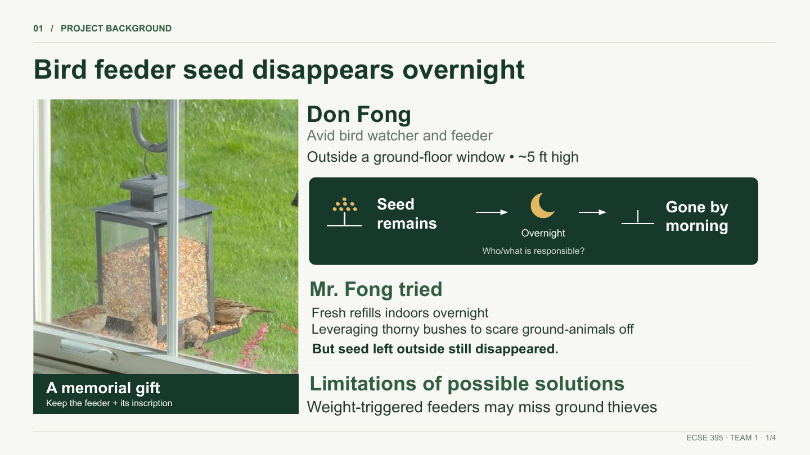
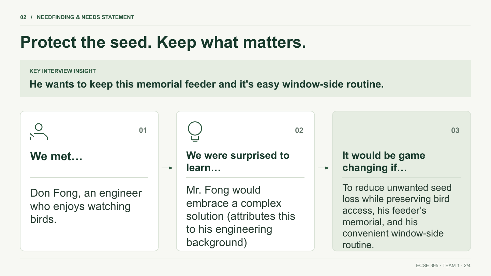
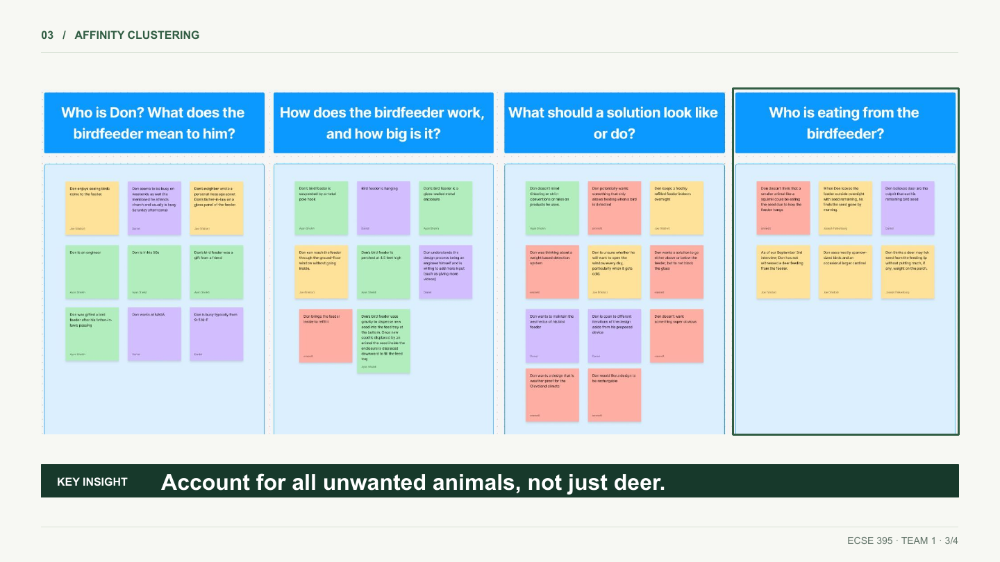
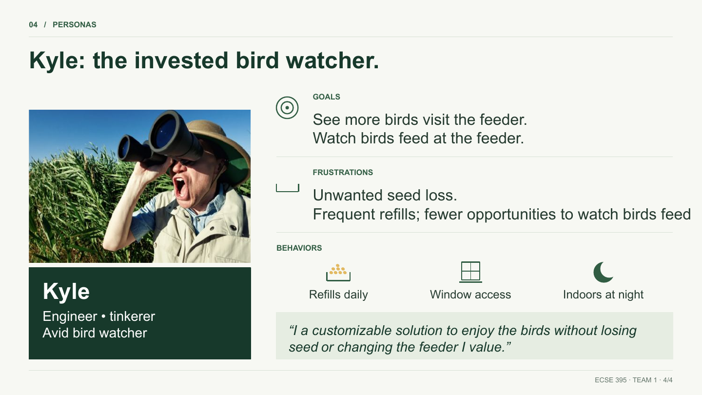

# Week 4 Project Log

**Student:** Joe Falkenburg

**Team role:** Secretary

**Teammates:** Ayan Sheikh, Emmett Gillespie, and Daniel Lim

**Project:** Bird-feeder project

**Stakeholder:** Don Fong

**Reporting period:** September 12 through September 18, 2026

This week's lab handout asks that individual contributions be clearly separated from what the group did as a whole, so the first section below is only my own work and the second is what we did as a team.

## Individual Contributions

### 2026-09-15 and 2026-09-16: Functional and Technical Specifications, My Sections as Person 1

For the Functional and Technical Specifications assignment we split the two documents four ways by specification number, with each of us also finding and citing one engineering standard connected to one of our own technical specs. I was Person 1: functional specifications FS.01–FS.03, the technical specifications TS.01–TS.03 derived from them, and the standard tied to one of those. I worked on my sections in our shared Google Doc and over text with the team on Tuesday and Wednesday.

- **FS.01–FS.03, what the system must do without saying how.** Reduce overnight seed removal by non-bird animals from Don's existing feeder; preserve daytime feeding access for the birds that use it; and stay operational when exposed to rain. Each one cites where the need came from: my Week 2 interview minutes, the affinity clusters, and the bird-feeding video Don sent on September 6.
- **TS.01–TS.03, the numbers.** At least a 90% reduction in the mean overnight unwanted-seed-loss rate compared with the unmodified feeder, over at least three baseline/prototype night pairs; at least 90% of the baseline daytime feeding-visit rate retained for each of the two bird groups Don described (sparrow-sized birds and cardinals), counted separately rather than pooled, over at least three matched two-hour observation blocks; and zero rain-induced functional failures during and immediately after an IEC 60529 IPX4 water-spray exposure. I wrote the basis note that goes with them: the 90% limits are engineering targets we set ourselves, not thresholds Don stated, measured prototype results, or percentages from the standard.
- **V.01–V.03, how we would actually test them.** The verification definitions for those three specs: how the night pairs and daytime blocks are run and attributed (time-stamped video, seed weighed before and after, alternating order, a measurement-error guard band), what makes a trial inconclusive rather than a pass, and the IPX4 spray procedure with functional checks before, during, and right after the spray, with no drying, restart, or adjustment allowed to get a pass.
- **The standard, IEC 60529 (the IP Code) for TS.03.** I picked IPX4, splashing water from any direction, as the rain-exposure target and cited the current edition's clauses for the spray method and the ingress inspection. This closed a loop from my Week 3 reflection: the IP65/IP67 ratings I floated there were examples, not requirements, and the document says so; IPX4 is our chosen target, not a rating Don or Dr. Fu prescribed. I also added the coverage note that FS.01 does not address daytime non-bird feeding and FS.03 addresses rain, not freezing, snow, or the rest of a Cleveland winter, so those stay separate concerns.

### 2026-09-15 and 2026-09-16: Needfinding Presentation, Theme and Slides

Emmett set up the Google Slides deck with the affinity-clustering slide, which he made from our submission himself. I built the theme and three of the remaining slides from our Project Background and Needs Statement submission, using what that document already said, whether the section was mine (the Project Background) or a teammate's, and turning it into slides: choosing what to show, the visuals, the layout, and one consistent look. The substance was the submission's; the synthesis into slides and the theme were mine. Ayan made the second persona slide (Mark) from the submission himself, in my theme.

- **Theme.** Cream background, a dark forest green for headings, panels, and callout bands, a lighter sage green for highlight boxes, a small numbered section label at the top of each slide ("01 / PROJECT BACKGROUND"), hairline rules top and bottom, a footer with the team and slide number, and simple line icons instead of clip art.
- **Slide 1, Project Background (the slide I presented).** Headline "Bird feeder seed disappears overnight"; a still from the video Don sent on September 6, showing the feeder with sparrows on it, captioned "A memorial gift: keep the feeder + its inscription"; a dark panel that tells the problem as a sequence, a full-feeder icon ("Seed remains") to a moon ("Overnight") to an empty-feeder icon ("Gone by morning"), with the open question "Who/what is responsible?"; what Don has already tried (fresh refills kept indoors overnight, thorny bushes under the feeder) and that seed left outside still disappeared; and the limitation that weight-triggered feeders may miss a ground animal that never puts weight on the perch.
- **Slide 2, Needfinding and Needs Statement.** Headline "Protect the seed. Keep what matters."; a "key interview insight" banner (he wants to keep this memorial feeder and his easy window-side routine); and the needs statement laid out as the three-card sequence from class, "We met…", "We were surprised to learn…", "It would be game changing if…", with an icon on each card and arrows between them.
- **Slide 3, Affinity Clustering (Emmett's slide, restyled).** I kept his content and applied the theme: the section label, framing, and footer, the dark "KEY INSIGHT" band, a green outline around the "Who is eating from the birdfeeder?" cluster the insight comes from, and a shorter insight sentence. His read "Key insight: our solution must be able to potentially prevent other animals, not just deer, from eating at the feeder."; the final slide says "Account for all unwanted animals, not just deer."
- **Slide 4, Personas (Kyle).** The first persona slide: photo and name card (engineer, tinkerer, avid bird watcher), goals and frustrations, three behavior icons (refills daily, window access, indoors at night), and the persona's quote in a highlight box.

The four slides I worked on are below. Ayan's Mark slide follows the same layout.

### 2026-09-16: Presenting the Project Background Slide

We gave the needfinding presentation in class on Wednesday. I presented the first slide, the project background, in about 70 seconds against a target of roughly 30 seconds per speaker. I hope to be more concise in the future.

### 2026-09-18 at Approximately 11:20 AM: Meeting Agenda

Under the agenda arrangement from our September 11 meeting (Ayan and I share the internal-meeting agendas, sent as a short group-chat message), I posted the agenda for the 1:00 PM meeting in our group text: draft the email to schedule the stakeholder concept review.

### 2026-09-18 from 1:00 to 2:00 PM: Internal Team Meeting, Email Draft, and Meeting Minutes

I attended our internal team meeting in person in the third-floor lab in Olin. I had suggested we draft the Email to Schedule Stakeholder Concept Review during the meeting, and I took part in shaping it with everyone else. I also raised the point about what Dr. Fu had said in class regarding when the stakeholder meeting had to happen, which is worked through in the minutes. In my role as secretary I recorded attendance and took the minutes included below.

## Team Activities and Decisions

- **2026-09-14 through 2026-09-16:** Ayan was ill, so we requested and received a 48-hour extension on the Functional and Technical Specifications, from Monday to Wednesday. We split the two documents four ways by specification number, collaborated in a shared Google Doc and over text on Tuesday and Wednesday, and submitted them on Wednesday, September 16.
- **2026-09-15 and 2026-09-16:** We built the needfinding presentation deck on Emmett's Google Slides setup, from our Project Background and Needs Statement submission.
- **2026-09-16:** We gave the needfinding presentation in class.
- **2026-09-18:** We met in person from 1:00 to 2:00 PM and drafted the email to schedule the concept review with Don, starting from the course's email template. All four of us took an active role in shaping it. We submitted the draft on Canvas during the meeting at about 1:50 PM.
- **2026-09-18:** We proposed Wednesday, September 23, at 6:00 PM for about an hour, the first day that worked for all four of us (and inside the weekday-after-5 availability Don gave us on September 3). I brought up that I thought Dr. Fu had said in class the meeting had to be held by Monday; my teammates thought it was likely not due that soon, since the brainstorming for the meeting is not due until Monday at 11:59 PM, which seemed feasible to me, and they agreed to ask Dr. Fu. No resolution yet.
- **2026-09-18:** The email has not been sent. We thought we need Dr. Fu's approval before sending it, but we are not sure, and we are still deliberating over text.
- **2026-09-18:** We are still making up time from Ayan's illness. If needed, we may ask Dr. Fu for the same 48 hours for the stakeholder meeting and the brainstorming milestone.
- **2026-09-18:** Brainstorming came up separately from the agenda and was deferred to the weekend and Monday. Nothing beyond the days has been settled, and no work on the three concept ideas for the stakeholder meeting has been done yet.
- **2026-09-12 through 2026-09-18:** No stakeholder contact in either direction this week; the only stakeholder-related work was preparing the scheduling email.

## 2026-09-18: Internal Team Meeting Minutes

**Time:** 1:00–2:00 PM · **Location:** Olin, third-floor lab (in person) · **Minutes recorded by:** me (Joe Falkenburg), team secretary

| Meeting date | Team member | Attendance |
| --- | --- | --- |
| 2026-09-18 | Joe Falkenburg | Present |
| 2026-09-18 | Ayan Sheikh | Present |
| 2026-09-18 | Emmett Gillespie | Present from about 1:35 PM (prior commitment, approved by the team) |
| 2026-09-18 | Daniel Lim | Present |

**Agenda** (posted in the group text at about 11:20 AM): draft the email to schedule the stakeholder concept review.

### 1. Purpose of the Meeting

The one agenda item was the Email to Schedule Stakeholder Concept Review: write the draft together, agree on the date and time to propose to Don, and submit it. Brainstorming for the upcoming milestone and our overall timeline after Ayan's illness came up along the way.

### 2. Email to Schedule the Stakeholder Concept Review

I had suggested we write the email during the meeting rather than have one person draft it alone. We started from the course's email template, and all four of us took an active role in shaping it.

Most of the discussion was about the date. Everyone shared their availability and we deliberated between days. Wednesday, September 23, was the first day that worked for everyone, so we proposed 6:00 PM for about an hour (a weekday evening, inside the availability Don gave us on September 3) and said we are flexible if that does not work for him. The draft we settled on:

> Dear Mr. Fong,
>
> We would like to schedule a meeting with you to present several design concepts for your birdfeeder. Would you be available to meet on Wednesday, September 23, at 6:00 PM for about an hour?
>
> We are flexible with the timing, so if that date or time does not work for you, please let us know when you are available.
>
> We look forward to speaking with you again and sharing our ideas.
>
> Thank you,
> Ayan, Daniel, Emmett, and Joe

We submitted the draft on Canvas during the meeting at about 1:50 PM.

I raised a point from class: I thought Dr. Fu had said we needed to hold the stakeholder meeting by Monday. My teammates did not think it was due that soon. The brainstorming for that meeting is not due until Monday at 11:59 PM, and a meeting held by Monday would have to start before the brainstorming for it is even due, so the meeting deadline is likely later. That seemed feasible to me. They agreed to ask Dr. Fu; there is no resolution yet.

Sending is on hold. We thought we need Dr. Fu's approval before the email goes to Don, but we are not sure whether that is the case, and we did not settle on a plan. We are still deliberating over text, and the email has not been sent.

### 3. Catching Up After Ayan's Illness

We are still making up time from Ayan being sick. We were diligent about it, got the Functional and Technical Specifications done under the extension and gave the presentation on Wednesday, but we are still catching up. If it becomes necessary, we may ask Dr. Fu for the same 48 hours we received for the specifications, for the stakeholder meeting and the brainstorming milestone.

### 4. Brainstorming Milestone

Brainstorming was not on the agenda but came up, and we deferred it: formal brainstorming will happen over the weekend and on Monday. Nothing beyond the days is settled.

### 5. Follow-Up

- **2026-09-18 — Open:** Whether Dr. Fu's approval is needed before the email goes to Don. Deliberation continuing over text; once it is settled, I send the email.
- **2026-09-18 — My teammates:** Ask Dr. Fu when the stakeholder meeting actually has to be held (I thought he said by Monday; they think likely later, because the brainstorming for it is not due until Monday at 11:59 PM). No resolution yet.
- **2026-09-18 — If needed:** Ask Dr. Fu for the same 48-hour extension for the stakeholder meeting and the brainstorming milestone.
- **2026-09-18 — All of us:** Formal brainstorming over the weekend (September 19–20) and Monday (September 21); format and place not yet set.
