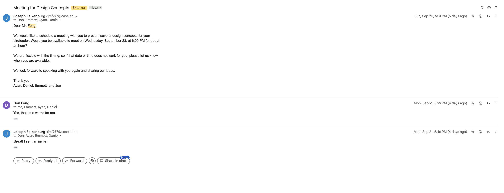

# Week 5 Project Log

**Student:** Joe Falkenburg

**Team role:** Secretary

**Teammates:** Ayan Sheikh, Emmett Gillespie, and Daniel Lim

**Project:** Bird-feeder project

**Stakeholder:** Don Fong

**Reporting period:** September 19 through September 25, 2026

## Individual Contributions

### 2026-09-20 through 2026-09-24: Stakeholder Coordination for the Concept Review

As secretary I handled our correspondence with Mr. Fong around the concept review. On Sunday, September 20 at 6:31 PM I sent him the email we had drafted the week before to schedule the meeting, proposing Wednesday, September 23 at 6:00 PM for about an hour and telling him we were flexible. He replied on Monday, September 21 at 5:29 PM that the time worked, and I sent the calendar invitation at 5:46 PM that afternoon.

After the meeting I emailed him our brainstorming document on Wednesday, September 23 at 9:21 PM, and the next day at 9:08 PM I sent a corrected, full-PDF version after the formatting from our working document had shifted the spacing. The screenshots below show the scheduling thread and the document emails with their dates and times.

### By 2026-09-23: Brainstorming Milestone — My Ideas, the Concepts, and Integrating the Document

For the brainstorming milestone each of us put forward ten ideas, forty in all, and we narrowed them into three design concepts. My ten were the last block in the ideas table. They clustered around detection, timing, and getting the hardware off the feeder: an initial camera-and-scale observation week to actually measure what is taking the seed, a weighing hanger, a night shroud lowered from the hook arm, a sunrise-and-sunset clock schedule with no light sensor, sliding port plates and a "ports shut unless a bird is on the tray" gate, a pole-mounted motion sensor with a lick strip on the rim, a padded swat arm with re-trigger logic, a buffered power rail with a hard current limit, and an "everything on the pole, nothing on the feeder" mounting arrangement.

I also helped shape the forty ideas into the three concepts alongside Ayan and Emmett. The padded-swat-arm concept was the one closest to my own ideas, growing directly out of my swat-arm idea, and I co-presented it at the stakeholder meeting.

A large part of my contribution was turning the material into the integrated document we submitted and building everything below the three concepts: the appendices of supporting research and calculations, and the references. I took a draft whose sources were scattered and not embedded and integrated it, weaving the citations into the ideas and concepts and adding the appendices that work through the engineering basis behind them: the access-mechanism-and-timing research for the cage, shroud, and gating ideas; the sensing-and-component limits for the cameras, sensors, and the swat arm's electronics; and the energy and runtime math for the battery budget. Those appendices are not only about my own ten ideas. They work through the research and calculations behind ideas and concepts from across the team, so the grounding applies to the whole document.

I made that a deliberate choice, and it is the part of this milestone I cared most about. My instinct is that an idea is only worth as much as its basis: if a concept rests on a hunch, you usually end up tearing it back down and rebuilding once the hunch does not hold, and I would rather not rebase ideas that were never really predicated on anything. That is why our concepts carry corroborating sources, and why I leaned the technical-specification tables and the appendices toward proposed verification, meaning how we would actually test each specification, while keeping those proposed assessments explicitly separate from results, since we have not run any prototype tests yet.

That emphasis came out of Dr. Fu's lectures, and it is what I was most compelled by. Dr. Fu frames the hardest part of design as turning words into numbers, and is passionate that technical specifications be testable and quantifiable; his design-process diagram puts verification on the path from a design back to its input requirements, labeled in his own words "Veritas: truth" and tied to the technical specs. Verification as the discipline of showing a design is true to its requirements lined up exactly with how I already think about grounding an idea, so when the September 23 lecture laid the process out in full, with verification plans, protocols, and acceptance criteria, I wanted to start applying it now instead of waiting. Verification and validation is its own milestone later in the course, so building the basis and the proposed tests into the brainstorming document now also put us ahead on that work. I understood none of it was required at this stage; I built it in because I believe in it and because I wanted us ahead. The same instinct is actually behind one of my questions in lecture! I believe it was on September 14. I noted the tension between Dr. Fu's under-thirty-minutes framing for a prototype and his wanting prototypes to be intentional; he gave a longer estimate when he answered, and that thorough-versus-quick tradeoff stuck with me, so I was interested to confirm what he thought, and some of my ideas and preferences of deliberate planning were reinforced, which excited me.

We submitted the document on Wednesday, September 23 at 5:47 PM, within our extension. The next day I resubmitted a corrected PDF at 2:37 PM after the conversion from our working document had thrown off the spacing, which Dr. Fu said he would accept as on time.

### 2026-09-23: Concept Review Meeting — Co-Presenting and Minutes

I attended the concept review with Mr. Fong on Zoom at 6:00 PM. Ayan, Daniel, and I took the call together from Glennan, and Emmett joined from elsewhere. Ayan and I presented the padded-swat-arm concept together, with Ayan opening it, as we had planned beforehand. In my role as secretary I recorded attendance and took the minutes included below, and I sent Mr. Fong the document afterward.

## Team Activities and Decisions

- **2026-09-20 and 2026-09-21:** We sent Mr. Fong the email to schedule the concept review on Sunday, September 20, and he confirmed Wednesday, September 23 at 6:00 PM the next day. I handled the correspondence and the invitation.
- **Through 2026-09-23:** We had a 48-hour extension on the brainstorming milestone because of Ayan's illness the week before, which moved it to Wednesday; this is the last extension we will take on account of that illness. We submitted the brainstorming document on Wednesday, September 23 at 5:47 PM, and I resubmitted a spacing-corrected PDF on Thursday, September 24 at 2:37 PM, which Dr. Fu accepted. Dr. Fu approved the brainstorming document.
- **2026-09-23 (before the meeting):** Ayan, Daniel, and I met in Glennan and took the Zoom meeting from there, with Emmett joining separately. We had finished the brainstorming earlier, so discussed and planned how to present it together then and with Emmett virtually: walking Mr. Fong through the document and splitting it so Ayan took the stand-off cage, Ayan and I took the padded swat arm, and Emmett took the AI-camera concept. This took the place of a formal agenda.
- **2026-09-23:** We held the concept review with Mr. Fong over Zoom. We presented the three concepts, he gave feedback and ranked them, and we agreed to develop all three toward a minimum viable product before down-selecting. The minutes are below.
- **2026-09-25:** We skipped our usual Friday 1:00 PM internal meeting because of Ayan's office hours; this week the concept review with Mr. Fong served as our team meeting.

## 2026-09-23: Concept Review Meeting Minutes

**Date:** 2026-09-23 · **Time:** 6:00 PM to about 6:40 PM · **Platform:** Zoom · **Minutes recorded by:** me (Joe Falkenburg), team secretary

| Meeting date | Attendee | Attendance |
| --- | --- | --- |
| 2026-09-23 | Don Fong (stakeholder) | Present |
| 2026-09-23 | Joe Falkenburg | Present |
| 2026-09-23 | Ayan Sheikh | Present |
| 2026-09-23 | Emmett Gillespie | Present |
| 2026-09-23 | Daniel Lim | Present |

### 1. Purpose of the Meeting

We met with Mr. Fong to present the three design concepts we developed for his bird feeder and to gather his feedback and preferences before taking the concepts further. We shared our brainstorming document on screen, walked him through it, and told him we would send it to him afterward.

### 2. From Needfinding to Three Concepts

We reminded Mr. Fong where the project stands: since our last conversation we turned our needfinding into the in-class presentation and then generated a large pool of ideas, each of the four of us contributing ten and forty in all, ranging from small subsystems to full solutions. We grouped and narrowed the overlapping ideas into three concepts, which we presented in turn. The document also contains a table, shared across all three concepts, that maps Mr. Fong's needs (our functional specifications) to how each concept addresses them and to the measurable technical specifications we derived from those needs.

### 3. Concept 1 — Stand-off Cage (presented by Ayan)

The first concept is a stand-off cage: a metal cage that hangs from the same support hook as the feeder but independently of the feeder itself, holding roughly a two-inch clearance at the opening and about a four-to-five-inch stand-off from the exposed seed, so a bird can pass through and reach the tray while a deer cannot get its head to the seed. The opening size would be adjustable, and one section would be removable so Mr. Fong can still lift the feeder off to refill it the way he does now. Nothing attaches to the feeder, so the memorial panel and its inscription stay untouched. Because the cage is passive, with no sensors, power, or moving parts, it has very few points of failure, needs no charging, and preserves both the view of the birds and the inscription. We would prototype it from the feeder's measured dimensions, most likely as a 3D CAD model first, so the fit and the margins are right before anything is built.

Mr. Fong said this concept resonated with him precisely because it does not shroud the feeder; the feeder is a memorial gift, and over-enclosing it would take away its visual appeal. Initially, his main question was whether it is acceptable for the course for a concept to use no electronics at all. He wanted to be sure we would not head down a path that Dr. Fu might fault for not using the sensors and actuators we were given, while making clear that he does not personally need electronics and that solutions do not always have to be as complex as we first assume. We explained that the sensors and actuators are provided as tools and a reference point rather than strict requirements, but agreed that for a design course it is important to integrate them meaningfully, and said we would carry that into how we iterate.

### 4. Concept 2 — Padded Swat Arm (presented by Ayan and me)

Ayan introduced Concept 2, and I presented it with him: a padded swat arm combining the mechanical and electrical sides of the project. The goal was to detect a large mammal within a defined area around the feeder and, after confirming non-bird access and safe clearance, trigger a servo-controlled padded arm to sweep beside the tray as a scarecrow-style deterrent. The idea drew on a revolving-arm device studied for keeping deer away from cattle feeders. A manual interlock would disable the arm entirely for refilling and maintenance. The arm would move only in response to an encounter rather than run continuously, although standby sensing would still consume power. Both Concepts 2 and 3 would need rechargeable power subsystems sized for at least 24 hours of operation, including standby loads and repeated responses. The battery was not included in our ESP32 kit, so we were checking feasibility and considering using our Thinkbox stipend to obtain the additional parts. We had also raised the need to keep the bill of materials modest with Dr. Fu. Another benefit we discussed was avoiding a full enclosing mesh and the additional wind and weather hazards that a poorly secured enclosure could introduce.

Mr. Fong asked how detection would work at night, including whether we planned to use ultrasonic or visual sensing. I explained that our concept used a pole-mounted passive infrared sensor, or PIR, to detect movement and wake the controller. It responds to changes in thermal radiation, so that initial detection step would not require daylight, UV, or visible lighting. However, Mr. Fong had solid skepticism because a motion signal would not identify the animal, and a lack of further movement would not prove that it had left. Our plan therefore still needed a separate contact or occupancy check before activating the arm, followed by clearance checks before each limited repeat and a stop if the mechanism encountered an obstruction or had insufficient stored energy. So I realized that although the second check was already part of our concept, we had not settled how to implement it reliably. I then transitioned to explain when the system would be allowed to respond. During the daytime bird-access window, the arm would remain disabled and parked outside the birds’ landing and escape paths; nighttime deterrence would only be enabled outside that window. We would use a battery-backed clock and our site coordinates to calculate sunrise and sunset, giving us a deterministic schedule instead of letting fluctuating ambient brightness decide when the arm could activate. We would also allow buffer time around dawn and dusk and extend the bird-access window based on observed visits. Don then asked what would protect the feeder during the day if the arm was disabled. I acknowledged that this version focused on overnight protection and would leave daytime non-bird feeding unaddressed, but that was because we planned to use ideas and concepts as subsystems to be combined, and we were about to explain Concept 3, which would be the daytime version of detection. I also cited my understanding of the burden that is bringing the feeder inside every night, and my goal to give attention to removing that chore in its own idea. Ayan echoed that we could combine the sensing, control, and response subsystems from different concepts instead of treating each concept as an indivisible design. I connected this to his preference for modularity: if the swatter stopped working, an independently operating camera subsystem could still be useful for daytime monitoring while he temporarily returned to bringing the feeder inside at night. Don was satisfied with the overnight goal and encouraged us to explore combinations, but we reconvened later to discuss how we may have wanted to compartmentalize by just idea, not concept as well, to make things more clear. Else, combine the concepts. Anyways, that prompted us to want to explain Concept 3 without waiting too long, wrapping up discourse about Concept 2. Probably also due to the unresolved sensing thing and cost concerns. Looking back, I wish I had connected the occupancy question to the capacitive “lick strip” (Idea 37 in our brainstorming document). That idea paired the PIR’s approach signal with an insulated electrode around the rim to detect possible contact. It would still have needed testing to distinguish relevant animal contact from bird feet, rain, or wet seed, and a capacitance change alone would not establish unwanted feeding or safe clearance. Separately, after the meeting, I came up with another possibility beyond our original document: testing a short-range infrared distance sensor for the second presence check. I wanted to investigate whether it could help determine that something remained beside the tray after the PIR detected an approach, while recognizing that a distance reading would not identify the animal or establish clearance throughout the arm’s sweep. I also thought we could test the detection logic with an indicator LED standing in for the arm, recording when the controller would have activated and comparing those events with video. That would help us examine missed detections and false triggers before enabling movement and decide whether the extra sensor justified its cost and complexity. We would still need the bench assessment already called for in our plan to evaluate the arm’s impact, rebound, and trapping risks before any wildlife trial, which we realized later on when discussing latency.

### 5. Concept 3 — AI Camera with Buzzer and Light (presented by Emmett)

The third concept is an AI camera paired with a buzzer and light. A low-light camera mounted underneath the feeder periodically takes photos, on the order of once every 10 to 30 seconds rather than a constant video feed, to save power, and an image classifier running on the ESP32 microcontroller evaluates each one. If it detects a deer, it plays a deterrent sound, flashes a light, or both. The sound can be tuned above the range of human hearing, since deer respond to higher frequencies, so it would not be a nuisance to Mr. Fong or his neighbors. It is similar to the motion-triggered deterrents people put in gardens, except that camera-based recognition means it only fires for the animal we are targeting rather than for anything that moves. Of the three, this concept is the least obtrusive on the feeder, with no cage and no arm, just small components underneath, and it can be retrained toward other animals such as squirrels or raccoons if they ever become a problem. The main design challenge is fitting an efficient enough classifier onto the microcontroller; if the on-board model is not capable enough, the image processing could be offloaded over Wi-Fi to a nearby computer instead of running at the feeder. We discussed on-device versus offloaded processing, and how it could potentially introduce latency that would, rather than prevent say a deer from eating, actually block it from leaving easily, inflicting harm and causing more feed to be eaten, potentially. We discussed how it could be acceptable to run it on one of our laptops as a prototype, with Mr. Fong drawing the comparison to how his Nest doorbell camera recognizes a package, and the tradeoffs of latency and cost that come with sending images off to be processed. And we talked about researching how processing on such cameras works, because it would be similar. We were unsure of how it worked on those. Mr. Fong noted that so far the smaller animals have not been able to climb onto the feeder's support, and he liked that the system could learn to handle other animals if that changed.

### 6. Mr. Fong's Preferences and Feedback

Mr. Fong told us he thought all three concepts were explained clearly and well. When we asked whether he had a preference, he ranked the stand-off cage the lowest of the three: even though he would not rule it out, its bulk around the feeder would take away from the memorial's appearance, which matters most to him. He was roughly even between the padded swat arm and the AI-camera concept, finding both intriguing and viable, and noted that the AI concept's computational cost is an unknown right now that depends on the processor we end up using.

### 7. Path Forward

We explained how we plan to proceed: we will take all three concepts further as mockups, diagrams, and system architectures, then down-select to a single minimum viable product to build as a physical prototype. We emphasized that whatever we build, we want to keep it reconfigurable for Mr. Fong, for example a way for him to toggle settings himself, because he has told us he likes to adjust and tinker with things. We offered to send the brainstorming document after the meeting and invited him to reply to the whole team with any further thoughts, as he said he was not decided and would follow up, and we felt more context could help.

### 8. Follow-Up

- **2026-09-23 — Me:** Send Mr. Fong the brainstorming document. Done that evening, with a corrected-formatting PDF sent the next day.
- **2026-09-23 — All of us:** Resolve the nighttime detection question for the padded-swat-arm concept.
- **2026-09-23 — All of us:** Determine, within our technical specifications, whether the image classifier can run on the ESP32 or should be offloaded to a nearby computer, for the AI-camera concept.
- **2026-09-23 — All of us:** Develop all three concepts as mockups, diagrams, and architectures, then down-select to a minimum viable product to prototype.
- **2026-09-23 — All of us:** Keep the eventual design reconfigurable so Mr. Fong can adjust it himself.
