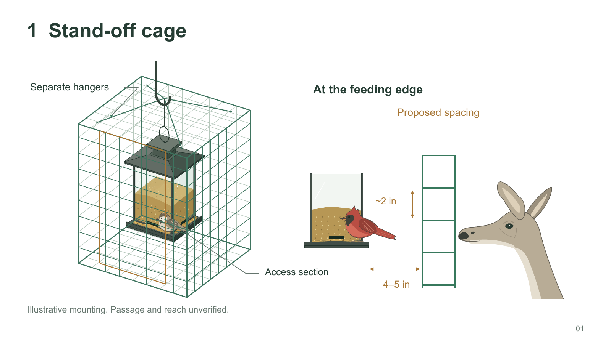
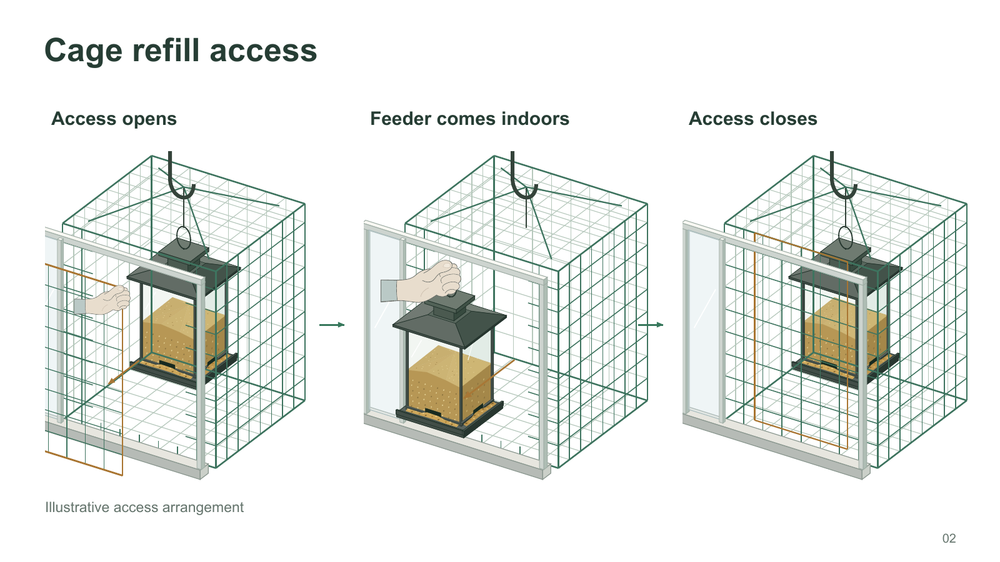
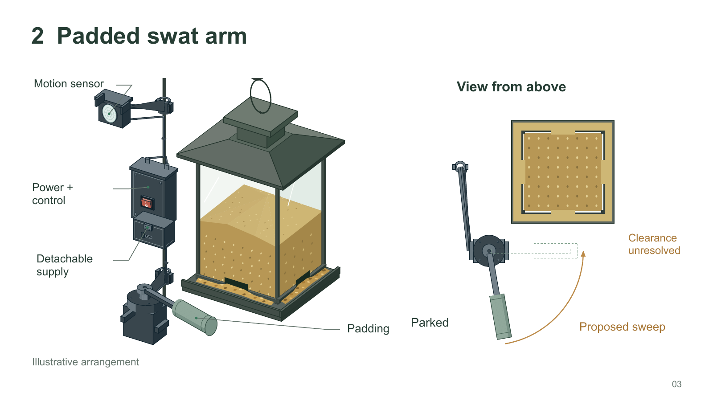
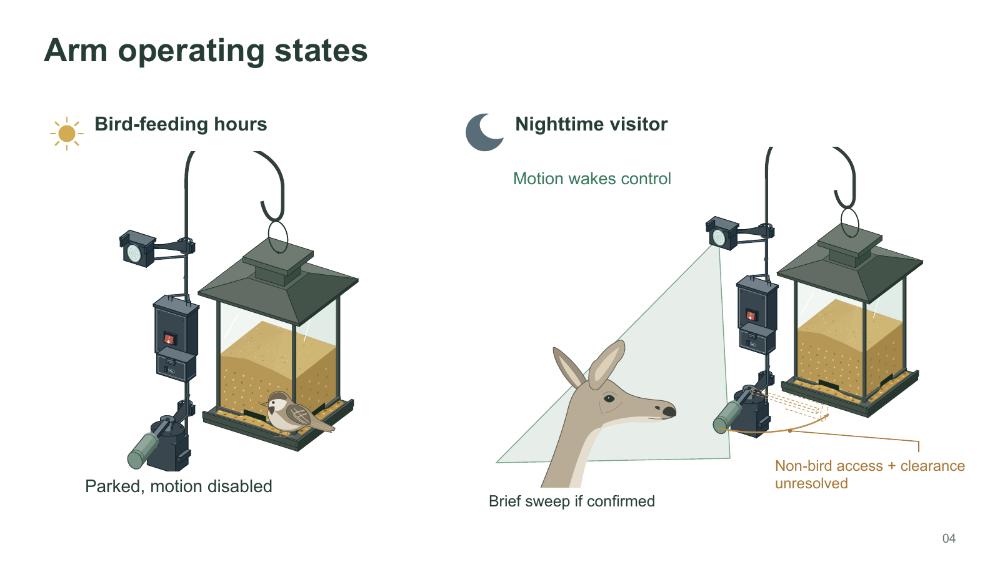
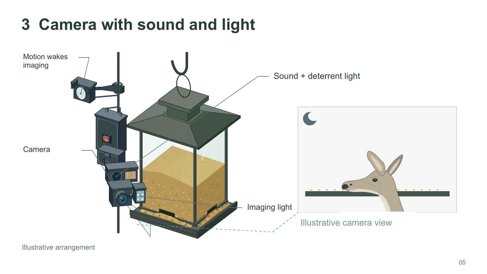
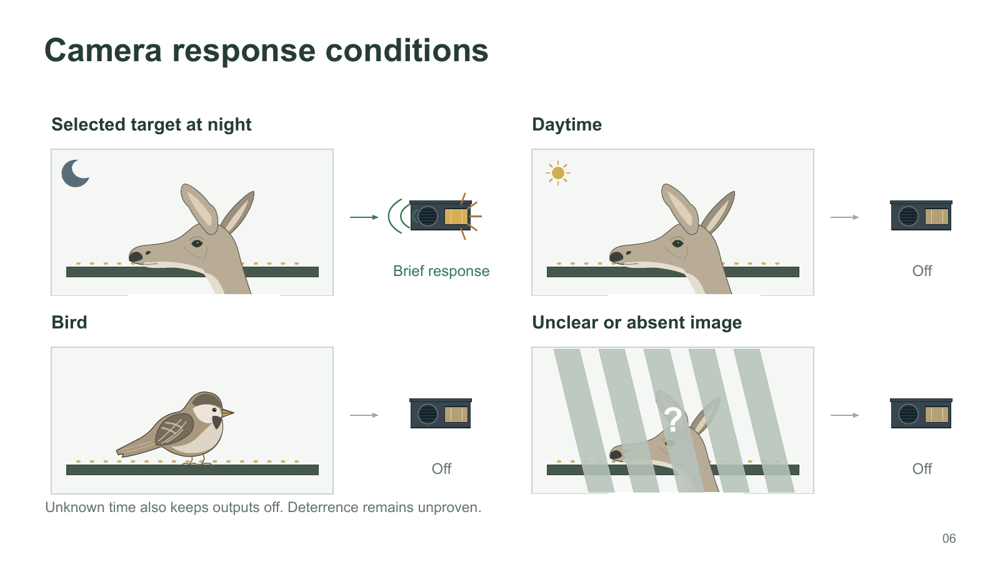
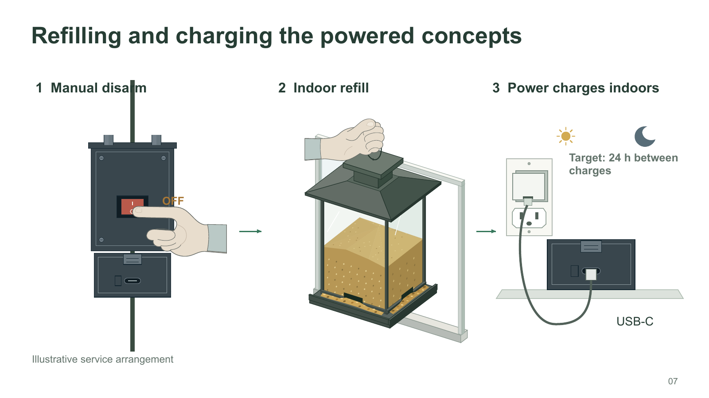

# Week 6 Project Log

**Student:** Joe Falkenburg

**Team role:** Secretary

**Teammates:** Ayan Sheikh, Emmett Gillespie, and Daniel Lim

**Project:** Bird-feeder project

**Stakeholder:** Don Fong

**Reporting period:** September 26 through October 2, 2026

## Individual contributions

### 2026-09-26 through 2026-10-02: Concept illustrations and submission assembly

I made seven illustrated Keynote slides for the concept-selection assignment we developed and submitted this week. I built drawings of the stand-off cage, padded swat arm, and camera with sound and light, then used copies of those drawings to show their operation, refill access, and charging. I also recapped Don's feedback with the group. My teammates used that discussion and my concept-review minutes to write the feedback sections, and I combined their writing with screenshots of the slides in our submission.

In the recap, I brought the discussion back to the problems Don had identified in each concept. The cage's bulk would detract from the memorial feeder's appearance even with the inscription visible, which was why he ranked it last. For the arm, motion alone would not tell us which animal was present or whether it remained beside the feeder after stopping. He also asked how we would protect the seed during the day while the arm was disabled. He liked the camera's ability to recognize different animals, while processing hardware, cost, and delay still needed investigation. He was roughly even between the two powered concepts.

#### Drawing tools and vector experiments

I explored SF Symbols, SVG Repo, Lucide, Font Awesome, and Google Material Symbols for graphics to use in Keynote. I considered feeder and birdhouse vectors, birds and deer, camera and sensor graphics, power and charging components, and symbols for day, night, sound, and light. I looked through [SVG Repo's feeder collection](https://www.svgrepo.com/vectors/bird-feeder-feeder/) for starting artwork. I imported SVG files into Keynote, used **Format > Shapes and Lines > Break Apart**, and edited their individual pieces. I also brought graphics from SF Symbols into my Keynote slides.

I placed [the still from Don's bird-feeding video](images/week4-slide1-project-background.png) underneath my Keynote drawing and traced the feeder's main contours, then adapted those outlines and added shapes for its parts. I found reference pictures of birds, deer, a wall outlet, a camera, a motion sensor, and a motor online and traced their contours in Keynote to build those drawings. I enlarged the reference pictures, lowered their opacity, and locked them underneath my work. I combined the outlines I traced with rectangles, ovals, and separate shading pieces, then removed the reference pictures. I built the custom controller and battery enclosures and their mounts directly from basic shapes.

I used **Draw with Pen** for the roof's irregular faces and the animal outlines. I clicked to place corners and dragged while placing points where the outline needed to bend. Closing the outline let me give it a fill; leaving it open gave me a detail line. I adjusted the points and curve handles to fit the reference, beginning with the outline's proportions and then working on the smaller bends.

I inserted rectangles for the box fronts, window rails, and outlet plate. I resized them, chose **Format > Shapes and Lines > Make Editable**, and moved their points where I needed angled ends or adjoining edges. I gave neighboring faces separate solid fills, with darker shades on the sides and lighter shades on top. For rounded parts, I resized circles into ovals, joined them with drawn side pieces, and added narrow shapes in different shades along the sides.

After assembling a feeder or animal drawing, I selected and grouped its pieces so I could copy and resize it as a whole. I left parts that needed to move in the sequences, such as the cage panel and detachable battery, separately selectable. I used the Arrange controls to position objects and change their order where one part needed to pass in front of another.

#### Stand-off cage and refill access

With Don's still underneath as a tracing guide, I began the feeder with the tray. With the pen tool, I placed the corners of its upper surface, closed that shape, and drew narrow front and side faces along its edges. For the posts and rails, I inserted rectangles, stretched them to the needed proportions, and adjusted their ends to meet the tray and roof. I duplicated those pieces for the other corners and edges.

I drew each roof face separately by clicking its corners with the pen tool. After closing the faces, I moved their points until the shared edges met, then assigned their fills. I repeated that process for the raised center section and cap. I drew the glass panels as separate shapes with pale fills, then drew and closed the front and side seed regions over them. Across the top of the mound, I drew adjoining triangular shapes and gave them slightly different fills. I made a few small grain shapes, duplicated them across the mound and tray, and varied their positions and fills. I added thin, light diagonal strokes over those layers for the glass reflections. For the hanging ring, I inserted an oval, removed its fill, and used its border for the outline.

For the cage, I drew the outside edges of each face first. I made a wire line, duplicated it at intervals, and adjusted the copies' endpoints to follow the face's angle. I repeated that process in the crossing direction to make the mesh. I grouped the rear wires separately from the front wires and gave them a thinner, lighter stroke. I placed the rear mesh behind the feeder and the front mesh ahead of it. I grouped the removable panel's wires with its amber outline so I could move the panel independently. I drew separate hanging lines from the cage and feeder to the support above.

I traced the sparrow's head, body, and tail as one closed outline, then drew filled shapes over it for the breast, cheek, crown, throat, and wing. I added the feather markings and feet as open lines, drew the beak and eye with small filled shapes, and placed another small shape over the eye for its reflection. After grouping the bird, I scaled and positioned it so its feet met the tray. I drew the cardinal from its reference in the same way, shaping the crest and adding its red areas and dark face marking.

For the deer, I traced the outer head and neck, added the ears and their inner patches, and drew the muzzle and facial details over that base. I kept the eye, nose, mouth, and contour lines separately editable while adjusting their positions. I grouped the finished animal for copying into the later scenes.

For the enlarged feeding-edge detail, I built a separate front view of the tray and frame from rectangles and added a short section of mesh beside it. I copied the cardinal and deer into that view and adjusted their sizes and positions around the feeding edge. Beside the mesh, I added amber dimension lines and labels for an opening of about two inches and a stand-off of four to five inches. I labeled those dimensions as proposed and marked bird passage and the deer's reach as unverified.

For the refill sequence, I built the window from long rectangles. I edited the points at their ends to join the frame and sill, then added narrow side faces with darker fills. I grouped the window pieces so I could copy the frame while moving the feeder and access panel independently.

I drew the gripping hand without a reference. I used the pen tool for its outer palm-and-finger outline, then added a separate path for the wrapped-finger details, a thumb contour, thumbnail, palm fold, and cuff. I adjusted those pieces individually as I fitted the hand around the panel edge or hanging ring. I changed the stacking order so the rail or ring passed behind the hand where the fingers wrapped around it.

I copied the cage, feeder, window, and hand into three scenes. In the first, I moved the panel away from the cage and fitted the hand to its edge. I shortened the surrounding front wires to end at the access opening. For the middle scene, I moved the feeder through the window and repositioned the hand around its ring, leaving the cage and hangers in place. In the final scene, I returned the feeder and panel to the closed position. I placed green arrows between the scenes to connect the steps.

#### Padded swat arm and operating states

I copied the feeder into the arm slide and built the pole-mounted equipment beside it. I inserted rectangles for the front faces of the controller and lower battery enclosure, then added side and top faces, moved their corner points to meet the fronts, and assigned a different solid fill to each face. I added smaller inset shapes, removed their fills, and used thin borders for the lid seams. For the screw heads, I duplicated small circles with short slot lines, then placed them at the corners. I added the switch surround and red rocker as separate shapes, followed by the latch and charging opening.

With the motion-sensor picture underneath, I traced its outer contour and built the housing and hood from separate faces. I simplified the detail on the sensor face into an oval, a few rings, and dividing lines to keep it recognizable at the size I used on the slide. To draw those, I stretched a circle into an oval and added the line work over it. I drew the bracket and collar from basic shapes around the pole and adjusted their edges to meet the housing.

I traced the motor's main contours from its reference picture and built up its body and joint as separate pieces. For the rounded joint and padded arm, I resized circles into elliptical endcaps and drew connecting side faces between them. I represented the rounded surfaces with narrow shading pieces, giving each a solid fill and working from darker edges toward lighter areas. I adjusted the outlines and shading to fit the angle and size of the assembly, then added seams and small highlights. I drew the arm stem as a separate narrow shape at the motor joint and gave the padding its own outline and endcaps. I added the mounting brackets, fasteners, and cable paths around the assembly.

I built the overhead view separately. I started with a square tray, inset the seed area, and placed narrow frame pieces and copied grain marks around it. I inserted a circle for the motor pivot, added the surrounding mount, and drew the arm outward from that pivot. For the proposed endpoint, I copied the arm outlines, removed their fills, and gave them dashed borders. I positioned those pieces around the same pivot.

To make the sweep arrow, I drew a short line and duplicated it. I moved each copy's endpoints to follow the arc around the motor, gave the pieces the same amber stroke, and drew a separate triangular tip at the end. I placed the clearance label beside that path.

For the operating-state slide, I selected and copied the feeder and equipment into two scenes. I placed the sparrow on the tray in the daytime scene and made a sun by surrounding a filled circle with short lines. For the night scene, I flipped the deer drawing and positioned it toward the feeder, then added a drawn crescent moon.

I drew a triangular observation region from the motion sensor toward the visitor, gave it a translucent green fill, and moved it behind the equipment and animal. I copied the outlined arm position and sweep-arrow pieces into the night scene and fitted them around the motor. I labeled the controller's motion-triggered wake-up and the arm's brief sweep after confirmation, and marked non-bird access and clearance as unresolved.

#### Camera, sound, and light

I reused the feeder, pole, controller, battery, and motion sensor for the camera concept and removed the arm parts from that copy. With the camera reference picture underneath, I traced the housing's outline and constructed its front, side, and top faces from separate shapes. I edited their corners to meet and added the hood above the lens. I simplified the finer lens detail into separate layers for the barrel, rim, glass, and inner opening. To build those layers, I inserted circles, stretched them into matching ovals, and resized successive copies. I placed a small light shape over the glass for its reflection.

I built the imaging-light housing beside the camera and duplicated small circles across its face. For the sound and deterrent-light unit, I drew another box, placed an oval on its front for the grille, and duplicated narrow filled slot shapes across it, adjusting their ends to fit the oval. I added a separate amber rectangle for the light panel. I fitted the brackets and cables around these components and positioned the labels beside them.

I built the camera view from a rectangular background and a narrow feeding ledge. I copied grain marks onto the ledge and placed the deer and moon above it. Where the animal extended outside the view, I put white rectangles over the excess and aligned their edges with the frame. I connected the camera to this view with a dashed blue leader.

I duplicated the camera view into a two-by-two arrangement for the response conditions. I kept the deer and moon for the nighttime target. For daytime, I replaced the moon with the sun; for the bird case, I replaced the deer with the sparrow and fitted its feet to the ledge. I drew a small front view of the response unit and copied it beside each frame, with arrows between the views and outputs.

For the active response, I added green sound strokes and short amber rays around the output unit. I labeled the other copies "Off". In the unclear-image example, I placed five broad, slanted, semitransparent strips over the deer and added a white question mark. I labeled each response condition and included the notes that unknown time keeps the outputs off and that deterrence remained unproven.

#### Refilling and charging

I made a new front view of the controller and battery for the manual-disarm scene. I began with rectangles for the enclosures, added inset borders, and duplicated the screw heads. I placed the switch surround and rocker on the upper enclosure, then built the pointing hand over it.

I drew that hand without a reference as well. I shaped the main outline with the pen tool and added the folded-finger detail path, thumb fold, nail, and cuff as separate pieces. I moved and adjusted those pieces while placing the fingertip against the switch. The hands were weaker than the drawings I made from references. In the finished pointing hand, I mixed opposite side views in the upper and lower fingers, and the index finger I had drawn is missing.

For the refill scene, I copied the feeder, gripping hand, and window frame, then moved the hand to the feeder's ring and brought the feeder in front of the window. In the charging scene, I made a front view of the detached battery, added its inset seam, latch, and USB-C opening, and set it on a drawn sill.

I inserted and resized rectangles for the wall plate and charger, then traced the socket contours and openings from the outlet picture with the pen tool. I placed those smaller shapes over the plate and adjusted their points to fit the reference. For the lead, I placed points with the pen tool along the route down from the charger, around the hanging loop, and back up to the battery. I left that path open, adjusted the points to shape the loop, and increased its line thickness. I placed small connector shapes over the cable's ends where it met the charger and battery. I copied the sun and moon above the scene beside the target of twenty-four hours between charges.

### 2026-10-02 from 1:50 to 3:00 PM: Group lab work

I worked in lab with Ayan, Emmett, and Daniel during the normal class meeting time and a bit before and after. All four of us were present for the conversation with Dr. Fu about the course expectations and our concepts. We also worked through our approach to prototyping and examined the kit components we could use.

#### Lab attendance and time outside class

We clarified with Dr. Fu that we are expected to attend the Monday, Wednesday, and Friday lab sections, with a short in-person check-in on Fridays, and arrange at least nine hours of team work together outside those sections. We left arranging those outside work blocks for our next session.

#### The cage concept and combining subsystems

Dr. Fu pointed out that the stand-off cage did not involve devices. I explained that we had kept the initial brainstorming broad, with forty ideas across the team and no restriction that every idea had to use electronics. We also discussed the distinction between including a passive idea in that larger pool and choosing it as one of our final three concepts. We could have left the cage out of that shortlist.

I clarified that our approach to combining subsystems applied across both individual ideas and the three concepts. We could take useful sensing, control, power, or response elements from different concepts and use them together. The example I gave Dr. Fu was pairing the passive cage with the camera, ESP32, and sound/light subsystem. The cage would provide a physical barrier, while the electronic subsystem would identify an animal and control a response.

Two further combinations I did not raise with Dr. Fu are a sensor-controlled cage that a motor deploys or retracts, and camera classification controlling the padded arm. The first adds sensing and actuation to the cage's physical barrier. The second uses the camera to identify the animal before permitting an arm response. It would still require a separate assessment of the arm's clearance and safe movement.

#### Choosing prototypes that advance the design

As a team, we discussed how our early prototypes should relate to the eventual deliverable. I wanted each prototype to answer a question we need to resolve for the system we intend to build. Temporary hardware is useful when it lets us investigate that question and carry the result forward. I wanted us to think through what we would learn, what work could carry over, and what would need to change, so we would not build a demonstration around shortcuts that left its underlying design to be rebuilt later.

I proposed using a Mac's built-in camera and processor for the first recognition prototype, then sending the recognition result to the ESP32 to control the physical buzzer and light. We would need to define what the Mac sends to the ESP32 and how that result triggers the outputs.

We looked at the ESP32's specifications and model/software examples to investigate running recognition on the board itself. We kept a small on-board classifier as an option. The board's computing limits also made the Mac approach attractive for the first prototype, and we left the on-board choice for further investigation and a practical test.

My slides reflected my interpretation of how the design should work, influenced by my brainstorming ideas and the overlap between concepts. They show motion waking the camera, while the written concept proposes periodic photographs, with roughly thirty seconds between images as a starting idea. We kept motion-triggered imaging and periodic photographs as alternatives to compare through the prototype.

#### Infrared sensing, outputs, and power

We examined the kit's PIR motion sensor and separate infrared obstacle-detection module. A PIR signal indicates movement; it does not identify the animal or establish that it is still beside the tray after it stops moving. An obstacle-detection module could provide another presence signal, but we needed to find out whether it would work reliably in the feeder arrangement. Those limitations were part of our reasoning for pursuing camera-based identification.

Our next lab step was to wire the infrared components to the ESP32 and observe their outputs.

We also inspected the buzzer, LEDs, and power equipment and discussed how they would fit into the prototype. For bench work, we considered the arrangement I had used in Lab 4: the ESP32 powered from the Mac, with a separate power module supplying the output hardware. We also discussed the eventual rechargeable battery and USB-C charging arrangement.

## Team activities and decisions

- **2026-09-26 through 2026-10-02:** We developed and submitted the concept-selection assignment. We are pursuing Concept 3, a camera with sound and light. Don's feedback and our discussion with Dr. Fu shaped that direction. It builds mainly on Emmett's camera idea and draws on other ideas and subsystems from the group. The proposed system has power, camera/processing, deterrence, and housing subsystems. We proposed housing the hardware beneath the feeder to reduce its visual impact and set forty-eight hours between charges as the battery-life target. My concept illustrations show the pole-mounted arrangement and initial twenty-four-hour target.
- **2026-10-02:** We divided responsibilities for the System Architecture and Prototype Plan and began drafting the initial document.
- **2026-10-02:** We confirmed the Monday, Wednesday, and Friday lab attendance expectation and the requirement to arrange at least nine additional hours of team work together outside those sections. Arranging those work blocks is part of our next session.
- **2026-10-02:** We discussed prototype options, including my Mac-to-ESP32 proposal, and planned further investigation of on-board recognition and wiring tests for the infrared components.

## 2026-10-02: Internal team meeting minutes

**Date:** 2026-10-02 · **Time:** 10:50 AM to about 11:20 AM · **Platform:** Zoom · **Minutes recorded by:** Ayan Sheikh, team leader · **Edited and expanded by:** Joe Falkenburg

I edited the wording and organization, clarified the assignment deadline, and added my assigned sections and our weekend follow-up.

| Meeting date | Attendee | Attendance |
| --- | --- | --- |
| 2026-10-02 | Joe Falkenburg | Present |
| 2026-10-02 | Ayan Sheikh | Present |
| 2026-10-02 | Emmett Gillespie | Present |
| 2026-10-02 | Daniel Lim | Present |

### 1. Purpose of the meeting

We held our regular Friday team meeting to discuss our meeting schedule, the selected concept, and the System Architecture and Prototype Plan assignment.

### 2. Meeting schedule

We decided to continue our Friday meetings. We also considered moving them to Monday if more class time becomes available for lab work in place of lectures.

### 3. System architecture and prototype plan

We divided responsibilities for the System Architecture and Prototype Plan and began drafting the initial document.

> **Joe's note:** I was assigned system understanding and interface definitions, covering the system's overall operation and the connections between its subsystems.

We planned to continue the work over the weekend for the Monday, October 5 deadline.

### 4. Selected concept and path forward

We discussed continuing with Concept 3, the embedded AI camera with light and sound actuation, including design methods and constraints. The design draws mainly from Emmett's idea, with contributions from other ideas and subsystems.

The architecture will explain the physical arrangement and operation of the system. We will also explore the sensors and actuators supplied in the lab kit as we plan the prototypes.

### 5. Follow-up

- **2026-10-05 — Team:** Complete and submit the System Architecture and Prototype Plan by the end of the day.
